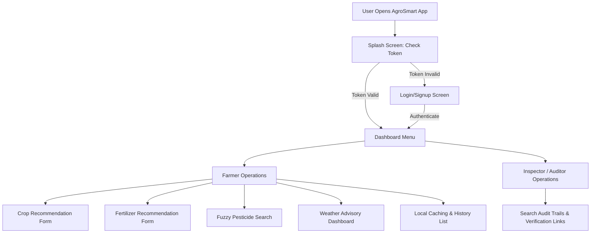
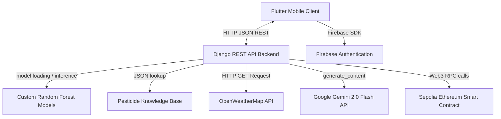
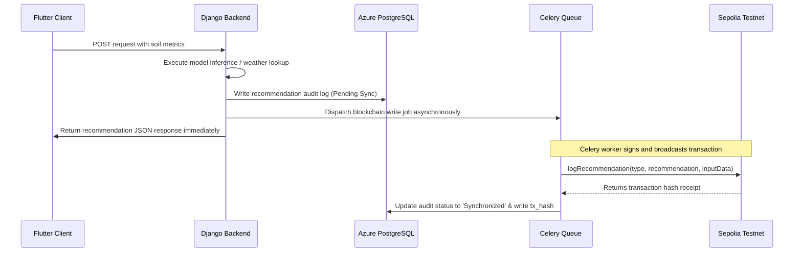
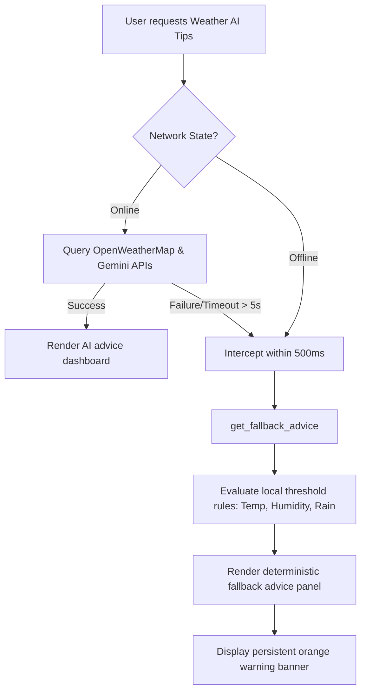

# High-Level Design Document: AgroSmart (Enterprise Agricultural Intelligence Platform)

**Project Name:** AgroSmart (Enterprise Agricultural Intelligence Platform)  
**Document Version:** 1.0  
**Date:** 06/22/2026  

---

### Authors
| Name | Role | Department |
| :--- | :--- | :--- |
| Muhammad Omer Siddiqui | Engagement Director & Lead Architect | Core Architecture & Management |
| Dr. Elena Rostova | Full-Stack Backend & Data Specialist | Backend Engineering |
| Tariq Mahmood | Frontend Mobile & QA Specialist | Mobile UI/UX & Testing |

### Document History
| Date | Version | Document Revision Description | Document Author |
| :--- | :--- | :--- | :--- |
| 06/22/2026 | 1.0 | Initial Functional Specification Baseline | Muhammad Omer Siddiqui |

### Approvals
| Approval Date | Approved Version | Approver Role | Approver |
| :--- | :--- | :--- | :--- |
| 06/22/2026 | 1.0 | Project Sponsor | Client Venture Team |
| 06/22/2026 | 1.0 | Lead Solution Architect | Muhammad Omer Siddiqui |

---

## Table of Contents
1. [Introduction](#1-introduction)
   - 1.1 [Why this High-Level Design Document?](#11-why-this-high-level-design-document)
   - 1.2 [Scope](#12-scope)
   - 1.3 [Definitions](#13-definitions)
   - 1.4 [Overview](#14-overview)
2. [General Description](#2-general-description)
   - 2.1 [Product Perspective](#21-product-perspective)
   - 2.2 [Tools Used](#22-tools-used)
   - 2.3 [General Constraints](#23-general-constraints)
   - 2.4 [Assumptions](#24-assumptions)
   - 2.5 [Special Design Aspects](#25-special-design-aspects)
3. [Design Details](#3-design-details)
   - 3.1 [Main Design Features](#31-main-design-features)
   - 3.2 [Application Architecture](#32-application-architecture)
   - 3.3 [Technology Architecture](#33-technology-architecture)
     - 3.3.1 [Client-Server Architecture](#331-client-server-architecture)
     - 3.3.2 [Presentation Layer](#332-presentation-layer)
     - 3.3.3 [Data Access Layer](#333-data-access-layer)
     - 3.3.4 [Tools Used](#334-tools-used)
   - 3.4 [Standards](#34-standards)
   - 3.5 [Database Design](#35-database-design)
   - 3.6 [Files](#36-files)
   - 3.7 [User Interface](#37-user-interface)
   - 3.8 [Reports](#38-reports)
   - 3.9 [Error Handling](#39-error-handling)
   - 3.10 [Interfaces](#310-interfaces)
   - 3.11 [Help](#311-help)
   - 3.12 [Performance](#312-performance)
   - 3.13 [Security](#313-security)
   - 3.14 [Reliability](#314-reliability)
   - 3.15 [Maintainability](#315-maintainability)
   - 3.16 [Portability](#316-portability)
   - 3.17 [Reusability](#317-reusability)
   - 3.18 [Application Compatibility](#318-application-compatibility)
   - 3.19 [Resource Utilization](#319-resource-utilization)
   - 3.20 [Major Classes](#320-major-classes)

---

## 1. Introduction

### 1.1. Why this High-Level Design Document?
The purpose of this High-Level Design Document is to establish the authoritative software engineering blueprint for the AgroSmart platform. This document translates the business requirements and functional specifications into a concrete, pre-development technical contract. The system will rely on this design to eliminate architectural conflicts, lock in validation parameters, and align client-server communication interfaces before implementation begins.

### 1.2. Scope
This design document defines the structural parameters, databases, processing layers, and external service gateways for the initial release of the AgroSmart platform. The document covers the end-to-end flow from mobile input validation to asynchronous machine learning inference, localized offline heuristics, and background blockchain transaction logging.

### 1.3. Definitions
*   **AgroSmart**: The Enterprise Agricultural Intelligence Platform.
*   **Random Forest Classifier**: The machine learning algorithm utilized to predict optimal crops and fertilizer components.
*   **Crop Recommendation Model**: The classification binary and associated label encoders that map soil chemical variables to crop categories.
*   **Fertilizer Prediction Model**: The classification binary and categorical mapping tables that output recommended fertilizer formulations.
*   **Sepolia Test Network**: The public Ethereum proof-of-stake test network hosting the agricultural audit smart contract.
*   **Celery Worker**: The background task runner process that manages asynchronous execution queues.
*   **Redis Broker**: The in-memory data store acting as the message broker for the background task queue.
*   **easy_localization**: The localization library configured to translate user interfaces on the mobile client.
*   **Provider**: The state management framework configured to orchestrate client-side operations.
*   **Etherscan**: The blockchain explorer portal used to verify audit receipt transaction hashes.
*   **Keychain / Keystore**: The hardware-level secure storage environments configured on target mobile operating systems.

### 1.4. Overview
The High-Level Design Document will detail:
*   The system-wide product perspective, tools utilized, design constraints, and technical assumptions.
*   The application architecture dividing standard farming tools from administrative audit portals.
*   The client-server data access, database table definitions, and serialized API contracts.
*   The exception handling codes and fallback operations during third-party network outages.
*   The non-functional design parameters governing execution speeds, security encryption, and change control procedures.

---

## 2. General Description

### 2.1. Product Perspective
The AgroSmart platform will operate as a secure client-server framework. The user client tier is a cross-platform mobile application, and the server tier is a Python Django REST API backend hosted on Microsoft Azure Web Apps. The backend interacts with custom serialized classification models, a PostgreSQL audit log database, OpenWeatherMap meteorological feeds, Google Gemini generative artificial intelligence servers, and public Sepolia Ethereum RPC nodes.

The system will implement a clear separation of capabilities between the two primary user personas:
1.  **Rural Farmer**: Standard authenticated access to crop and fertilizer prediction forms, pesticide lookup search engines, real-time weather alerts, and local diagnostic logs.
2.  **Scientific Review Inspector**: Administrative read-only access to global database records, keyword-based search queries, and external blockchain verification links.

The complete data routing workflow, text-based architecture flows, and swim lane loops are detailed textually and diagrammatically in Appendix B of the Business Requirements Document.

### 2.2. Tools Used
1.  **Flutter SDK**: The mobile client rendering framework targeting iOS and Android platforms.
2.  **Django REST Framework**: The server-side API application serving JSON data structures.
3.  **joblib & scikit-learn**: The Python libraries utilized to serialize and load pre-trained classification models.
4.  **Celery & Redis**: The asynchronous execution runner and message queue broker.
5.  **Azure Web Apps & PostgreSQL**: The cloud web server hosting environment and relational database database storage.
6.  **SQLite Helper**: The mobile client's local database engine configured to handle offline cache history.
7.  **Web3.py & Infura**: The blockchain connection library and RPC gateway node configurations.
8.  **easy_localization**: The frontend translation manager resolving Urdu and English localized dictionary assets.
9.  **Firebase Authentication**: The identity broker managing registration validation and credential checking.
10. **Google Gemini 2.0 Flash**: The large language model generating agricultural advice blocks.

### 2.3. General Constraints
*   **Capital Expenditure**: The total platform design, deployment, gas fee management, and hosting costs shall not exceed the **$35,000** limit.
*   **Form Layout Adjustments**: The mobile user interface shall disable native viewport resizing (`resizeToAvoidBottomInset` set to `false`) and calculate keyboard view-insets manually to prevent card collapses on low-end screens.
*   **Typographical Label Ingestion**: To prevent machine learning model execution crashes, the frontend input forms, API validation serializers, and database models shall strictly maintain the non-standard strings matching the pre-trained data layers:
    *   `Temparature` (misspelled with 'a' in the second syllable).
    *   `Humidity ` (containing a trailing space character inside the string).
    *   `Phosphorous` (misspelled with 'o' before 'u').

### 2.4. Assumptions
*   **GPS Hardware**: User devices possess functioning GPS receivers to capture geographic coordinates.
*   **Network Performance**: Staging environments will mimic standard connection speeds, and the local fallback rules engine will execute only when network calls exceed five seconds.
*   **Model Immutability**: The pre-trained Random Forest model structures will remain static unless the technical change escalation path is formally signed off.

### 2.5. Special Design Aspects
To maintain mobile UI responsiveness, the platform design will enforce a strict non-blocking audit strategy. Smart contract transactions shall never be signed or broadcast synchronously inside the HTTP request-response thread. Instead, execution is delegated to background Celery workers, ensuring the API returns crop and fertilizer suggestions to the mobile client in under two seconds.

---

## 3. Design Details

### 3.1. Main Design Features
The design details define the structural boundaries, database tables, and communication processes of the AgroSmart platform, visualizing the client-server interface loops and data persistence logic.

### 3.2. Application Architecture
The application architecture will isolate user workflows based on verified security profiles. Standard farmers will navigate crop, fertilizer, pesticide, and weather forms, whereas review inspectors will access read-only audit search lists and transaction verification hyperlinks:



### 3.3. Technology Architecture

#### 3.3.1. Client-Server Architecture
The system layout, data flows, and external integrations will follow the structural model depicted below:



#### 3.3.2. Presentation Layer
The presentation tier will execute natively on the target device via the Flutter framework. Screen rendering logic will monitor state changes through the Provider library. The views will use glassmorphic cards and local localization components to switch all on-screen titles, hints, and error logs instantly between Urdu and English.

#### 3.3.3. Data Access Layer
Data storage is split into two systems:
*   **Client SQLite Database**: Sandboxed storage file handling local log caching.
*   **Azure PostgreSQL Database**: Centrally hosted cloud database storing global telemetry and audit logs.

---

### 3.4. Standards
*   **Serialized Payloads**: The client and server will exchange data utilizing secure HTTPS connections and JSON formats.
*   **Blockchain Integration**: The Celery background task queue will broadcast transactions using Ethereum ABI standards, calling the contract function `logRecommendation(string type, string recommendation, string inputData)`.

---

### 3.5. Database Design

#### 3.5.1 PostgreSQL Global Audit Table
The backend database will log recommendation events to PostgreSQL using the following schema:
```sql
CREATE TABLE recommendation_audit_log (
    id SERIAL PRIMARY KEY,
    user_id VARCHAR(128) NOT NULL,
    query_type VARCHAR(64) NOT NULL,
    input_payload JSONB NOT NULL,
    output_result JSONB NOT NULL,
    blockchain_tx_hash VARCHAR(66),
    sync_status VARCHAR(32) DEFAULT 'Pending Sync',
    timestamp TIMESTAMP DEFAULT CURRENT_TIMESTAMP
);
```

#### 3.5.2 SQLite Client Caching Table
The mobile database helper class will initialize and query the local SQLite database using the following definition, maintaining the exact typographical field names:
```sql
CREATE TABLE diagnostic_history (
    id INTEGER PRIMARY KEY AUTOINCREMENT,
    user_id TEXT NOT NULL,
    query_type TEXT NOT NULL,
    inputs TEXT NOT NULL,     -- Stringified JSON matching: N, P, K, pH, Temparature, Humidity , Moisture, Phosphorous, etc.
    outputs TEXT NOT NULL,    -- Stringified JSON result payload
    tx_hash TEXT,             -- Sepolia transaction hash
    sync_status TEXT NOT NULL,-- 'Synchronized' or 'Pending Sync'
    timestamp DATETIME DEFAULT CURRENT_TIMESTAMP
);
```

---

### 3.6. Files
*   **Machine Learning Classifiers**: 
    *   The Crop Recommendation Model binary and the Crop Label Encoder binary.
    *   The Fertilizer Prediction Model binary, category Soil Type categorical encoder, and category Crop Type categorical encoder.
*   **Localization Dictionaries**: The Urdu and English localized dictionary assets packed within the application assets folder.

---

### 3.7. User Interface
The mobile presentation tier will consist of 9 main screens:
1.  **Splash Screen**: Evaluates start-up parameters and routes the user based on Firebase session tokens.
2.  **Login & Registration Screen**: frosted glass container overlaying the login background looping video asset.
3.  **Home Dashboard**: Central hub displaying metric counts and network state warning banners.
4.  **Crop Form Screen**: Numeric text fields, range guide overlays, and sliders for soil properties.
5.  **Fertilizer Form Screen**: Categorical selectors and inputs matching the required dataset typos.
6.  **Pesticide Search Screen**: Autocomplete crop name search box and multi-line symptom description text area.
7.  **Weather Smart Screen**: Coordinate display with manual coordinate adjustments and city quick-select buttons.
8.  **Diagnostic Results Screen**: Renders recommendation outputs and the external blockchain verification link.
9.  **Historical Audit Registry**: Categorically filterable, keyword-searchable history index with swipe-to-delete gestures.

---

### 3.8. Reports
The backend will compile administrative reports for review inspectors. Inspectors can query PostgreSQL logs, filtering records by query types or timestamps to generate transaction reports with clickable Etherscan verification hashes.

---

### 3.9. Error Handling
External integration exceptions will be caught, logged, and handled under unique identifiers:
*   **`ERR-INT-101` (OpenWeatherMap Failure)**: Network loss or API rate limits; backend falls back to mock Islamabad parameters and logs a warning.
*   **`ERR-INT-102` (Gemini API Limit reached)**: Free quota exhaustion; client intercepts query within 500ms and routes to the local fallback rules engine.
*   **`ERR-INT-103` (Web3 Sync Latency / Gas Failure)**: Worker retries Web3 signing up to 3 times before updating state to `'Pending Blockchain Sync'` and raising alert to DevOps.
*   **`ERR-INT-104` (Serializer Mismatch Error)**: Mismatch in expected spellings; serializer intercepts input data and forces data alignment validations.

---

### 3.10. Interfaces
*   **Hardware Interfaces**:
    *   **GPS Receiver**: Captures geographic latitude and longitude metrics.
    *   **Keychain / Keystore**: Encrypts JWT secure session tokens locally.
*   **Software Interfaces**:
    *   **OpenWeatherMap**: REST HTTP endpoint proxying weather conditions.
    *   **Google Gemini**: Cognitive formatting parser enforcing standard advising outputs.
    *   **Sepolia Ethereum RPC Node**: Auditing blockchain ledger. The Django REST framework view tier shall only write a localized record to the centralized database, mark its status as 'Pending Sync', hand off the payload parameters to a background task runner queue managed by Celery and Redis, and instantly return the suggestion back to the client. The background class worker alone shall handle Sepolia RPC node handshakes, sign the transaction payload using the server-side wallet key parameters outside the web process thread, handle block mining gas management, and update the PostgreSQL status log to 'Synchronized' with the resulting blockchain receipt hash.

---

### 3.11. Help
*   **Visual Onboarding Guide**: Step-by-step Urdu and English instructional graphics embedded in the mobile assets folder explaining soil data collection.

---

### 3.12. Performance
*   **API Response Time**: Server-side Random Forest model calculations must complete and return JSON recommendations in under 2.0 seconds.
*   **SQLite Latency**: Local database caching reads, writes, and query searches on the mobile client must execute in under 100ms.
*   **Offline Fallback Trigger**: UI network interceptors must trigger the local fallback engine in under 500ms when a connection drops.

---

### 3.13. Security
*   **Token Encryption**: Cached Firebase authentication tokens must be encrypted locally using Keychain or Keystore APIs.
*   **Credential Verification**: Password inputs must meet complexity checks (minimum 8 characters, uppercase, number, symbol) before account submission.
*   **Data Isolation**: Local SQLite database files will be sandboxed within the application directory to prevent unauthorized data access.

---

### 3.14. Reliability

#### 3.14.1 Asynchronous Blockchain Syncing Pipeline
The backend will offload smart contract auditing to background workers to guarantee that blockchain transaction delays never block the mobile UI:



#### 3.14.2 High-Availability Offline Rules Engine
If cellular networks timeout (exceeding 5 seconds) or the device goes offline, client-side interceptors will redirect execution to the local fallback rules engine within 500ms, using the following decision paths:



*   **Offline Heuristics**:
    *   *Rain / Thunderstorm*: watering = "No", fertilizer = "Wait", pest = "Medium", tip = "Cover sensitive crops".
    *   *Temp > 38°C*: watering = "Yes", fertilizer = "Wait - Heat causes burn", pest = "High", tip = "Provide shade".
    *   *Humidity > 80%*: watering = "No", fertilizer = "Wait - risk of fungus", pest = "High - fungal risk", tip = "Ensure good air circulation".

---

### 3.15. Maintainability

#### 3.15.1 Technical Change Escalation Path
To prevent validation exceptions and schema mismatches between client forms, database columns, and ML training sets (such as the non-standard fields `'Temparature'`, `'Humidity '`, and `'Phosphorous'`), any proposed schema changes must follow this approval path:
1.  **Data Science Verification**: Dr. Sarah Jenkins verifies that changes do not impact machine learning performance.
2.  **Django Serializer Realignment**: Dr. Elena Rostova updates backend API models and validation rules.
3.  **Client-Side Parity Check**: Lead Architect Muhammad Omer Siddiqui updates Flutter input controllers.
4.  **Project Sponsor Sign-Off**: Final approval from the Project Sponsor before deploying changes to staging.

#### 3.15.2 Exception Log Alerting
The database logging services will record third-party API timeout exceptions to PostgreSQL. Celery workers will monitor these logs; if Sepolia RPC connection drops persist beyond 3 retries, the worker will dispatch automated Slack alerts to the DevOps channel.

---

### 3.16. Portability
The Flutter codebase will compile into native iOS and Android binaries. The Django backend will run inside dockerized containers to ensure consistent environments across staging and production slots.

---

### 3.17. Reusability
Modular structures will remain decoupled:
*   The Random Forest inference logic will operate independently of the REST view serializers.
*   The SQLite caching classes will run as generic helper wrappers, allowing them to be reused for future transactional views.

---

### 3.18. Application Compatibility
Backward compatibility is maintained by decoupling models. Model updates will occur dynamically by replacing the pre-trained binaries on the server, ensuring that mobile client updates are not required to adopt updated machine learning configurations.

---

### 3.19. Resource Utilization
*   **UI Thread Performance**: Large data structures will be processed in asynchronous background isolates on the mobile client.
*   **Database Isolation**: PostgreSQL will record transaction records using JSONB types to prevent table-level indexing locks during parallel review inspector audits.

---

### 3.20. Major Classes
*   **`AuthService`**: Interfaces with Firebase hooks and Keychain/Keystore to cache session keys.
*   **`ApiService`**: Handles REST requests and directs endpoints depending on staging toggles.
*   **`DatabaseHelper`**: Manages the local SQLite database cache and query transactions.
*   **`RandomForestClassifier`**: Runs model predictions based on input data structures.
*   **`WeatherLLMManager`**: Queries weather services and parses Gemini prompts.
*   **`BlockchainWorker`**: signs transactions and broadcasts logs to Sepolia nodes.
