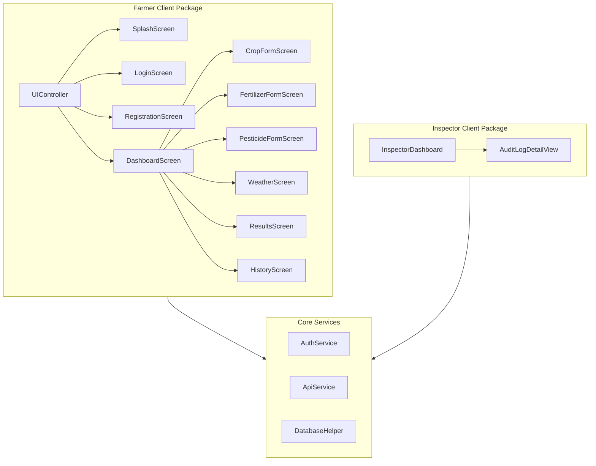
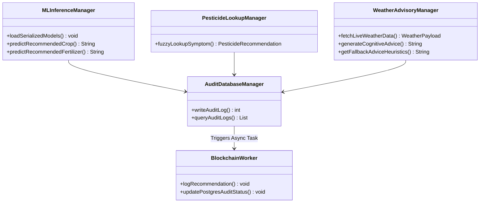
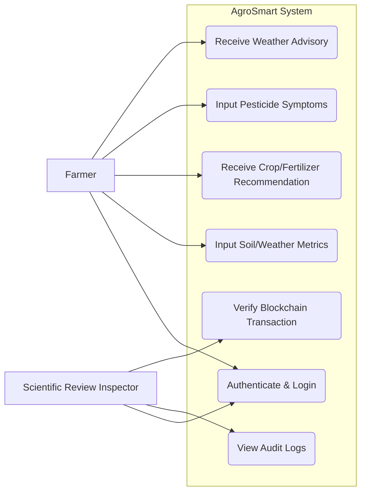
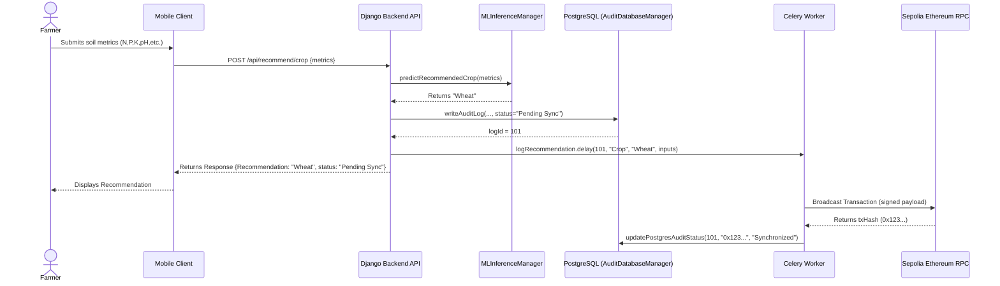
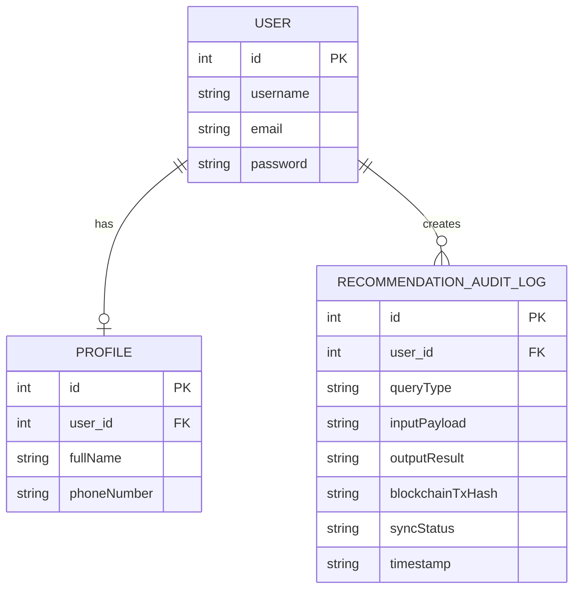

# Low-Level Design Document: AgroSmart (Enterprise Agricultural Intelligence Platform)

**Project Name:** AgroSmart (Enterprise Agricultural Intelligence Platform)  
**Document Version:** 1.0  
**Date:** 06/22/2026  

---

### Authors
| Name | Role | Department |
| :--- | :--- | :--- |
| Muhammad Omer Siddiqui | Engagement Director & Lead Architect | Core Architecture & Management |
| Dr. Elena Rostova | Full-Stack Backend & Data Specialist | Backend Engineering |
| Tariq Mahmood | Frontend Mobile & QA Specialist | Mobile UI/UX & Testing |

### Document History
| Date | Version | Document Revision Description | Document Author |
| :--- | :--- | :--- | :--- |
| 06/22/2026 | 1.0 | Initial Low-Level Design Baseline | Muhammad Omer Siddiqui |

### Approvals
| Approval Date | Approved Version | Approver Role | Approver |
| :--- | :--- | :--- | :--- |
| 06/22/2026 | 1.0 | Project Sponsor | Client Venture Team |
| 06/22/2026 | 1.0 | Lead Solution Architect | Muhammad Omer Siddiqui |

---

## Table of Contents
1. [Introduction](#1-introduction)
   - 1.1 [Object Design Trade-offs](#11-object-design-trade-offs)
     - 1.1.1 [Efficiency vs Concurrency](#111-efficiency-vs-concurrency)
     - 1.1.2 [Feasibility vs Extensibility](#112-feasibility-vs-extensibility)
     - 1.1.3 [Scalability vs Efficiency](#113-scalability-vs-efficiency)
     - 1.1.4 [Admin vs User Usability Focus](#114-admin-vs-user-usability-focus)
   - 1.2 [Interface Documentation Guidelines](#12-interface-documentation-guidelines)
   - 1.3 [Engineering Standards](#13-engineering-standards)
   - 1.4 [Definitions, Acronyms, and Abbreviations](#14-definitions-acronyms-and-abbreviations)
2. [Packages](#2-packages)
   - 2.1 [Client Side](#21-client-side)
     - 2.1.1 [User Client Package](#211-user-client-package)
     - 2.1.2 [Scientific Review Inspector Client Package](#212-scientific-review-inspector-client-package)
   - 2.2 [Server Side](#22-server-side)
3. [Class Interfaces](#3-class-interfaces)
   - 3.1 [Client Side](#31-client-side)
     - 3.1.1 [User Client Class Specifications](#311-user-client-class-specifications)
     - 3.1.2 [Service Class Specifications](#312-service-class-specifications)
   - 3.2 [Server Side](#32-server-side)
     - 3.2.1 [Controller and Service Class Specifications](#321-controller-and-service-class-specifications)
     - 3.2.2 [Model and Database Specifications](#322-model-and-database-specifications)
4. [System Diagrams](#4-system-diagrams)
   - 4.1 [Use Case Diagram](#41-use-case-diagram)
   - 4.2 [Sequence Diagrams](#42-sequence-diagrams)
   - 4.3 [Entity Relationship Diagram (ERD)](#43-entity-relationship-diagram-erd)
5. [References](#5-references)

---

## 1. Introduction

The Low-Level Design Document translates the AgroSmart High-Level Design into class-level definitions, method signatures, attributes, and package boundaries. This document serves as the implementation contract to construct the cross-platform mobile client and the Django REST API backend. It details data-validation bounds, typographical column rules, exception recovery paths, and asynchronous background operations.

### 1.1. Object Design Trade-offs

#### 1.1.1. Efficiency vs Concurrency
AgroSmart will prioritize concurrency over raw execution efficiency when writing audit trails to the blockchain. Direct cryptographic signing and transaction broadcasts to Ethereum Sepolia RPC nodes can introduce latency delays that freeze mobile interface threads. Consequently, the Django backend will hand off transaction payloads asynchronously to a background task queue managed by Celery and backed by Redis, returning the recommendation immediately to the client. The concurrency gains from non-blocking execution justify the added complexity of task runners and database sync state tracking.

#### 1.1.2. Feasibility vs Extensibility
Machine learning prediction models are subject to drift, requiring replacement as crop seasons progress. To keep the application extensible, the backend will decouple model loading operations. The prediction controllers will load classification configurations dynamically from binary serialization formats at server initialization. This design allows new models to be deployed without modifying the underlying Python view logic or database schemas.

#### 1.1.3. Scalability vs Efficiency
Local data access on the mobile client will prioritize immediate efficiency over unconstrained scalability. In regions with unstable cellular connectivity, querying remote APIs to retrieve log histories creates usability bottlenecks. Thus, the client application will write query parameters and diagnostic outputs to a localized relational SQLite cache. The local database will execute searches, category filtering, and records purging in under 100 milliseconds, optimizing performance at the device level.

#### 1.1.4. Admin vs User Usability Focus
*   **Farmer Usability Focus**: The mobile user interface will focus on simplicity, ease of learnability, and immediate results, using clean forms, sliders, and automatic localization switches to support lower digital literacy.
*   **Scientific Review Inspector Usability Focus**: The administrative interface will prioritize information density, sorting capabilities, and complete transaction logs to allow thorough audits, incorporating direct transaction links to verify data integrity.

### 1.2. Interface Documentation Guidelines
Class names shall follow singular `PascalCase` conventions. Methods and attributes will use `camelCase` identifiers. Parameters and return types must be explicitly declared. Class tables will conform to the following layout:

| Element | Specification | Description |
| :--- | :--- | :--- |
| **Class:** | `ClassName` | Functional overview and class purpose. |
| **Attributes:** | `attributeName: type` | Attribute description and type constraint. |
| **Methods:** | `methodSignature(params): returnType` | Method responsibility, parameters, and outputs. |

### 1.3. Engineering Standards
Unified Modeling Language (UML) guidelines will govern all class specifications, packages, and process loop diagrams. All system requirements will be verified through trace mappings in the Requirements Traceability Matrix to ensure compliance.

### 1.4. Definitions, Acronyms, and Abbreviations
*   **API**: Application Programming Interface.
*   **REST**: Representational State Transfer (JSON payloads over HTTP).
*   **NPK**: Nitrogen, Phosphorus, Potassium soil nutrients.
*   **WBS**: Work Breakdown Structure.
*   **CELERY**: Asynchronous task queuing system.
*   **REDIS**: In-memory broker routing queuing telemetry.
*   **SQLITE**: Embedded relational caching engine.

---

## 2. Packages

### 2.1. Client Side

The client-side mobile application is divided into standard farmer input screen packages and administrative audit views:

#### 2.1.1. User Client Package
*   **UIController**: Controls main application navigation routing and view rendering.
*   **SplashScreen**: Displays branding animations, pre-loads dictionaries, and checks active tokens.
*   **LoginScreen / RegistrationScreen**: Captures user credentials and registration inputs, enforcing safety paddings and password complexity.
*   **DashboardScreen**: Displays active diagnostics count and network warning banners.
*   **CropFormScreen / FertilizerFormScreen**: Captures soil chemical parameters; validates nutrient range limits.
*   **PesticideFormScreen**: Provides symptom entry blocks and autocomplete crop fields.
*   **WeatherScreen**: Retrieves sensor GPS coordinates or enables manual coordinate settings.
*   **ResultsScreen**: Renders calculated agricultural advice cards and blockchain verification links.
*   **HistoryScreen**: Lists historical entries using category selection chips and swipe-to-delete gestures.

#### 2.1.2. Scientific Review Inspector Client Package
*   **InspectorDashboard**: Displays list records of all processed diagnostic entries.
*   **AuditLogDetailView**: Renders full input properties, advice blocks, and Etherscan verification hyperlinks.

---

### 2.2. Server Side

The server backend is divided into model handlers, cognitive parsers, and background task queues:

*   **MLInferenceManager**: Ingests soil metrics and executes pre-trained Random Forest classifiers.
*   **PesticideLookupManager**: Parses disease symptoms using fuzzy text mapping.
*   **WeatherAdvisoryManager**: Integrates coordinates with OpenWeatherMap feeds and Google Gemini advice prompts.
*   **BlockchainWorker**: Signs Ethereum transaction payloads and broadcasts writes asynchronously to Sepolia contract ABIs.
*   **AuditDatabaseManager**: Manages PostgreSQL CRUD connections and queries.

---

## 3. Class Interfaces

### 3.1. Client Side

#### 3.1.1. User Client Class Specifications

##### SplashScreen
*   **Class:** `SplashScreen` | Coordinates application initializations and token checks on startup.
*   **Attributes:** None.
*   **Methods:**
    *   `checkSessionToken(): void` | Queries local storage for a Firebase session token. Routes to `DashboardScreen` if valid; routes to `LoginScreen` if expired.
    *   `loadLocalizationDicts(): void` | Pre-loads English and Urdu translation files into memory before drawing the layout.

##### LoginScreen
*   **Class:** `LoginScreen` | Handles credential submissions and language switches.
*   **Attributes:**
    *   `emailAddress: String` | User's email string.
    *   `password: String` | User's password string.
*   **Methods:**
    *   `login(email: String, pass: String): void` | Dispatches inputs to authentication services; routes to `DashboardScreen` on success.
    *   `toggleLanguage(): void` | Alternates localization files between English and Urdu.

##### RegistrationScreen
*   **Class:** `RegistrationScreen` | Validates registration parameters.
*   **Attributes:**
    *   `emailAddress: String` | User's email.
    *   `password: String` | Target password.
    *   `fullName: String` | User's name.
*   **Methods:**
    *   `register(email: String, pass: String, name: String): boolean` | Enforces complex password checks (8+ characters, uppercase, digit, symbol) and registers accounts.
    *   `showValidationErrors(): void` | Renders inline notifications for invalid input formats.

##### DashboardScreen
*   **Class:** `DashboardScreen` | Serves as the user home menu.
*   **Attributes:**
    *   `diagnosticCount: int` | Cached logs total on the device database.
    *   `isDeviceOffline: boolean` | Indicates active network status.
*   **Methods:**
    *   `updateBadgeCount(): void` | Queries local database utilities to update the history count.
    *   `routeToService(serviceName: String): void` | Navigates the user to crop, fertilizer, pesticide, or weather screen modules.

##### CropFormScreen
*   **Class:** `CropFormScreen` | Ingests chemical coordinates to recommend crops.
*   **Attributes:**
    *   `nitrogenLevel: float` | Nitrogen metric (range: `0.0 - 140.0`).
    *   `phosphorusLevel: float` | Phosphorus metric (range: `0.0 - 145.0`).
    *   `potassiumLevel: float` | Potassium metric (range: `0.0 - 205.0`).
    *   `soilPh: float` | Acidity value (range: `0.0 - 14.0`).
    *   `temperatureVal: float` | Local temperature in Celsius.
    *   `humidityVal: float` | Relative humidity percentage.
    *   `rainfallVal: float` | Soil precipitation in millimeters.
*   **Methods:**
    *   `submitCropRecommendation(): void` | Packages parameters into JSON and posts to backend API models.
    *   `displayGuidanceOverlay(metricName: String): void` | Displays overlays defining recommended agronomic ranges.

##### FertilizerFormScreen
*   **Class:** `FertilizerFormScreen` | Ingests soil properties to identify mix recommendations.
*   **Attributes:**
    *   `Temparature: float` | Soil temperature (**note spelling with 'a'**).
    *   `Humidity : float` | Relative humidity (**note trailing space**).
    *   `Moisture: float` | Relative moisture value.
    *   `Soil Type: String` | Category soil value (e.g. `Sandy`, `Loamy`).
    *   `Crop Type: String` | Category crop value (e.g. `Maize`, `Wheat`).
    *   `Nitrogen: float` | Nitrogen metric.
    *   `Potassium: float` | Potassium metric.
    *   `Phosphorous: float` | Phosphorus metric (**note spelling with 'o' before 'u'**).
*   **Methods:**
    *   `selectSoilChip(soilType: String): void` | Toggles Soil Type chips.
    *   `submitFertilizerRecommendation(): void` | Dispatches queries using exact typographical parameter spelling constraints.

##### PesticideFormScreen
*   **Class:** `PesticideFormScreen` | Handles pest descriptions.
*   **Attributes:**
    *   `selectedCrop: String` | Target crop name.
    *   `symptomDescription: String` | Text symptoms entered by the farmer.
*   **Methods:**
    *   `selectCropAutocomplete(crop: String): void` | Filters crop options as the user types.
    *   `submitPesticideDiagnosis(): void` | Submits symptoms to fuzzy text match backend views.

##### WeatherScreen
*   **Class:** `WeatherScreen` | Resolves coordinates for weather tips.
*   **Attributes:**
    *   `latitudeVal: float` | GPS latitude coordinates.
    *   `longitudeVal: float` | GPS longitude coordinates.
    *   `manualLocation: boolean` | True if manual city coordinates overrides are chosen.
*   **Methods:**
    *   `queryGPSLocation(): void` | Interacts with device hardware to resolve latitude and longitude coordinates.
    *   `setManualCoordinates(lat: float, lon: float): void` | Overrides coordinates with presets.
    *   `submitWeatherAdvisory(): void` | Sends coordinates to the server-side API.

##### ResultsScreen
*   **Class:** `ResultsScreen` | Displays advisory reports.
*   **Attributes:**
    *   `recommendedOutput: String` | Recommended crop/fertilizer output text.
    *   `weatherReadings: WeatherPayload` | OpenWeatherMap payload metrics.
    *   `advisoryCards: AdviceCard[]` | Parsed four-tier Gemini advice blocks.
    *   `blockchainTxHash: String` | Cryptographic Sepolia transaction hash.
    *   `syncStatus: String` | Current syncing state (`Pending Sync` or `Synchronized`).
*   **Methods:**
    *   `openEtherscanLink(txHash: String): void` | Opens the external explorer page to inspect transaction confirmations.
    *   `saveRecordToCache(): void` | Saves diagnostic results to local storage.

##### HistoryScreen
*   **Class:** `HistoryScreen` | Displays past diagnostic queries.
*   **Attributes:**
    *   `cachedRecords: LogRecord[]` | Cached records retrieved from the database.
    *   `selectedFilterCategory: String` | Filter constraint (e.g. `Crops`, `Weather`).
    *   `searchKeyword: String` | Keyword search query.
*   **Methods:**
    *   `filterHistoryByCategory(cat: String): LogRecord[]` | Limits list views to selected category.
    *   `searchHistoryByKeyword(word: String): LogRecord[]` | Filters records matching text strings.
    *   `deleteRecord(recordId: int): void` | Deletes a record from local storage; updates dashboard badge counts.
    *   `clearAllRecords(): void` | Purges all records from storage.

---

#### 3.1.2. Service Class Specifications

##### AuthService
*   **Class:** `AuthService` | Coordinates user session states with Firebase.
*   **Attributes:**
    *   `currentUser: FirebaseUser` | Firebase user reference.
*   **Methods:**
    *   `signInWithEmail(email: String, pass: String): Future<boolean>` | Authenticates credentials with Firebase.
    *   `registerWithEmail(email: String, pass: String, name: String): Future<boolean>` | Creates account records.
    *   `signOutUser(): Future<void>` | Clears credentials from local storage and terminates session.
    *   `getCachedToken(): Future<String>` | Retrieves secure session token.

##### ApiService
*   **Class:** `ApiService` | Manages server API requests.
*   **Attributes:**
    *   `useLocalBackend: boolean` | Toggles local (`127.0.0.1`) vs production Azure Web App URLs.
    *   `baseUrl: String` | Active target base URL.
*   **Methods:**
    *   `postRequest(endpoint: String, payload: Map): Future<JsonResponse>` | Executes POST operations.
    *   `getRequest(endpoint: String): Future<JsonResponse>` | Executes GET operations.

##### DatabaseHelper
*   **Class:** `DatabaseHelper` | Manages local SQLite storage transactions.
*   **Attributes:**
    *   `databaseInstance: SqliteDatabase` | Active SQLite connection reference.
*   **Methods:**
    *   `insertDiagnostic(record: LogRecord): Future<int>` | Caches diagnostic parameters.
    *   `retrieveAllDiagnostics(): Future<LogRecord[]>` | Returns all saved records.
    *   `deleteDiagnostic(recordId: int): Future<int>` | Purges a record by primary key.
    *   `clearDatabase(): Future<void>` | Drops all rows from history tables.

---

### 3.2. Server Side

#### 3.2.1. Controller and Service Class Specifications

##### MLInferenceManager
*   **Class:** `MLInferenceManager` | Manages machine learning model loading and predictions.
*   **Attributes:**
    *   `cropModelInstance: RandomForestClassifier` | Pre-trained crop prediction RandomForest instance.
    *   `fertilizerModelInstance: RandomForestClassifier` | Pre-trained fertilizer prediction RandomForest instance.
*   **Methods:**
    *   `loadSerializedModels(): void` | Loads model binaries at server initialization.
    *   `predictRecommendedCrop(N: float, P: float, K: float, temp: float, hum: float, ph: float, rain: float): String` | Predicts optimal crop choices.
    *   `predictRecommendedFertilizer(Temparature: float, Humidity : float, Moisture: float, soil: int, crop: int, N: float, K: float, P: float): String` | Predicts optimal fertilizer mix.

##### PesticideLookupManager
*   **Class:** `PesticideLookupManager` | Maps crop diseases to treatment suggestions.
*   **Attributes:**
    *   `pesticideDatabase: Map` | Disease symptom lookup database map.
*   **Methods:**
    *   `fuzzyLookupSymptom(crop: String, problemDesc: String): PesticideRecommendation` | Fuzzy text maps symptom strings to treatments; falls back to organic Neem Oil if no keywords match.

##### WeatherAdvisoryManager
*   **Class:** `WeatherAdvisoryManager` | Manages coordinates, weather conditions, and AI tips.
*   **Attributes:**
    *   `openWeatherMapApiKey: String` | API key.
    *   `googleGeminiApiKey: String` | Gemini API key.
*   **Methods:**
    *   `fetchLiveWeatherData(lat: float, lon: float): WeatherPayload` | Queries OpenWeatherMap API; falls back to mock Islamabad weather on failure.
    *   `generateCognitiveAdvice(weather: WeatherPayload, crop: String): String` | Prompts Google Gemini and parses output into 4 structured headers.
    *   `getFallbackAdviceHeuristics(weather: WeatherPayload, crop: String): String` | Executes deterministic threshold rules if APIs are offline.

##### BlockchainWorker (Celery background process)
*   **Class:** `BlockchainWorker` | Coordinates asynchronous smart contract log writing.
*   **Attributes:**
    *   `contractAbi: String` | contract ABI layout string.
    *   `contractAddress: String` | Deployed smart contract address.
    *   `privateKey: String` | Transaction gas fee payment private key.
    *   `signerAddress: String` | Wallet account address.
*   **Methods:**
    *   `logRecommendation(recordId: int, type: String, rec: String, inputs: String): void` | Celery background task: establishes RPC connections, signs transactions, handles gas management, and broadcasts writes to Sepolia smart contracts.
    *   `updatePostgresAuditStatus(recordId: int, hash: String, state: String): void` | Updates database log sync state flags to `Synchronized` with transaction hashes.

##### AuditDatabaseManager
*   **Class:** `AuditDatabaseManager` | Coordinates PostgreSQL audit logs.
*   **Attributes:** None.
*   **Methods:**
    *   `writeAuditLog(user: String, type: String, inputs: Map, outputs: Map): int` | Writes audit rows with `Pending Sync` sync state flags.
    *   `queryAuditLogs(filters: Map): List<LogRecord>` | Queries audit log history for review inspectors.

---

#### 3.2.2. Model and Database Specifications

##### Profile
*   **Class:** `Profile` | Extends authentication users with supplementary profile metadata.
*   **Attributes:**
    *   `user: OneToOneField` | Django base user relation link.
    *   `fullName: String` | User's full name.
    *   `phoneNumber: String` | Farmer phone number contact.

##### RecommendationAuditLog
*   **Class:** `RecommendationAuditLog` | PostgreSQL database model schema mapping.
*   **Attributes:**
    *   `id: int` | Primary key database ID.
    *   `userId: String` | Reference ID of querying user.
    *   `queryType: String` | Query type (e.g. `crop`, `fertilizer`).
    *   `inputPayload: JSON` | Ingestion input payloads, preserving dataset spelling typos (`Temparature`, `Humidity `, and `Phosphorous`).
    *   `outputResult: JSON` | Recommendation results JSON.
    *   `blockchainTxHash: String` | Sepolia transaction hash.
    *   `syncStatus: String` | Synchronization status (`Pending Sync` or `Synchronized`).
    *   `timestamp: DateTime` | Time of query insertion.

---

## 4. System Diagrams

### 4.1. Use Case Diagram

The use case diagram illustrates the primary actors and their interactions with the AgroSmart system.

### 4.2. Sequence Diagrams

#### 4.2.1. Soil Recommendation & Blockchain Logging

This sequence diagram depicts the process flow of a farmer submitting soil metrics, the backend generating a recommendation, and the Celery worker writing the audit log to the blockchain asynchronously.

### 4.3. Entity Relationship Diagram (ERD)

The ERD models the core database entities and their relational cardinality in the PostgreSQL database.

---

## 5. References
*   [1] Bruegge, B. & Dutoit, A. H. (2004). *Object-Oriented Software Engineering, Using UML, Patterns, and Java, 2nd Edition*. Prentice-Hall. ISBN: 0-13-047110-0.
*   [2] ISO/IEC/IEEE 29148:2018. *Systems and software engineering — Life cycle processes — Requirements engineering*.
