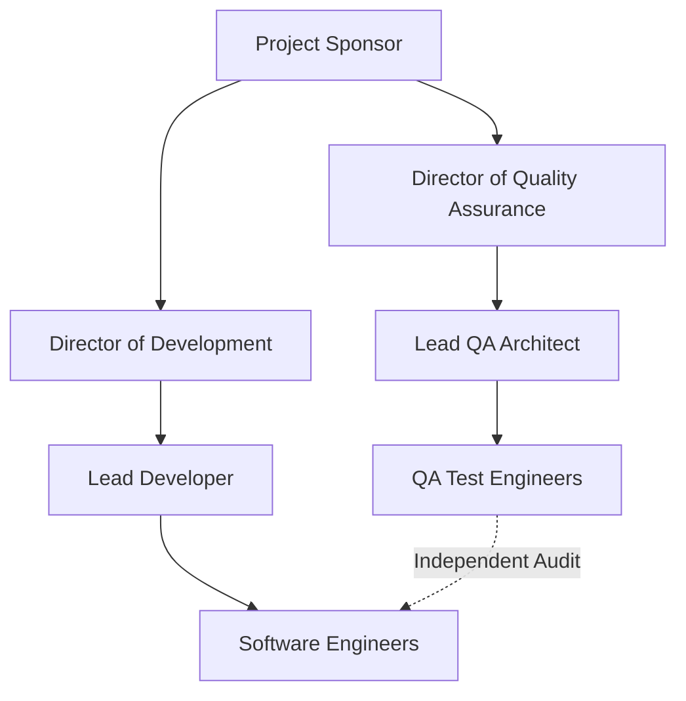

# Master Test Plan
## AgroSmart Enterprise Agricultural Intelligence Platform

**Document Identifier:** AS-MTP-2026-V1.0  
**Version:** 1.0 Final  
**Date of Issue:** June 23, 2026  
**Issuing Organization:** Quality Assurance Division  

---

## Table of Contents
- [1. Introduction](#1-introduction)
  - [1.1 Document Identifier](#11-document-identifier)
  - [1.2 Scope](#12-scope)
  - [1.3 References](#13-references)
    - [1.3.1 External References](#131-external-references)
    - [1.3.2 Internal References](#132-internal-references)
  - [1.4 System Overview and Key Features](#14-system-overview-and-key-features)
  - [1.5 Test Overview](#15-test-overview)
    - [1.5.1 Organization](#151-organization)
    - [1.5.2 Master Test Schedule](#152-master-test-schedule)
    - [1.5.3 Integrity Level Schema](#153-integrity-level-schema)
    - [1.5.4 Resources Summary](#154-resources-summary)
    - [1.5.5 Responsibilities](#155-responsibilities)
    - [1.5.6 Tools, Techniques, Methods, and Metrics](#156-tools-techniques-methods-and-metrics)
- [2. Details of the Master Test Plan](#2-details-of-the-master-test-plan)
  - [2.1 Test Processes Including Definition of Test Levels](#21-test-processes-including-definition-of-test-levels)
    - [2.1.1 Process: Management](#211-process-management)
    - [2.1.2 Process: Acquisition](#212-process-acquisition)
    - [2.1.3 Process: Supply](#213-process-supply)
    - [2.1.4 Process: Development](#214-process-development)
    - [2.1.5 Process: Operation](#215-process-operation)
    - [2.1.6 Process: Maintenance](#216-process-maintenance)
  - [2.2 Test Documentation Requirements](#22-test-documentation-requirements)
  - [2.3 Test Administration Requirements](#23-test-administration-requirements)
    - [2.3.1 Anomaly Resolution and Reporting](#231-anomaly-resolution-and-reporting)
    - [2.3.2 Task Iteration Policy](#232-task-iteration-policy)
    - [2.3.3 Deviation Policy](#233-deviation-policy)
    - [2.3.4 Control Procedures](#234-control-procedures)
    - [2.3.5 Standards, Practices, and Conventions](#235-standards-practices-and-conventions)
  - [2.4 Test Reporting Requirements](#24-test-reporting-requirements)
- [3. General](#3-general)
  - [3.1 Glossary](#31-glossary)
  - [3.2 Document Change Procedures and History](#32-document-change-procedures-and-history)

---

## 1. Introduction

### 1.1 Document Identifier
The system shall designate this document instance as `AS-MTP-2026-V1.0` under strict configuration management controls.

* **Document Reference ID:** AS-MTP-2026-V1.0
* **Current Version:** 1.0 Final
* **Date of Issue:** June 23, 2026
* **Structural State:** Approved Final
* **Issuing Department:** Quality Assurance Division

#### Sign-off Block
The following authorities approve the release and immediate implementation of this Master Test Plan:

| Stakeholder Name | Stakeholder Role | Department | Digital Approval Signature | Date Approved |
| :--- | :--- | :--- | :--- | :--- |
| Muhammad Omer Siddiqui | Lead Architect & Director | Core Architecture & Management | [APPROVED - M.O.S.] | June 23, 2026 |
| Dr. Elena Rostova | Full-Stack Backend & Data Specialist | Backend Engineering | [APPROVED - E.R.] | June 23, 2026 |
| Tariq Mahmood | Frontend Mobile & QA Specialist | Mobile UI/UX & Testing | [APPROVED - T.M.] | June 23, 2026 |

### 1.2 Scope

#### Tailoring
The Quality Assurance Division will adapt the IEEE Std 829-2008 verification lifecycle to match the rapid, 2-week iterative Agile Sprint configuration deployed across the development cycle. Rather than executing a single, late-stage waterfall testing phase, validation tasks will execute continuously. Unit testing and integration tests will run automatically upon every code modification and branch merge, while complete system validation and acceptance sweeps will occur at the conclusion of each sprint cycle.

#### Inclusions
The testing team shall execute comprehensive functional and non-functional tests across the following core platform subsystems:
*   **Flutter Mobile Client**: Interactive user screens, input verification validators, localization switches for Urdu and English languages, and local SQLite data caching helpers.
*   **Django REST API Backend**: Endpoint routing, data serialization interfaces, pre-trained crop and fertilizer classification engines, and OpenWeatherMap proxies.
*   **Asynchronous Processing Pipeline**: Celery worker queues, Redis message brokers, transaction signing processes, and Sepolia Ethereum RPC network updates.
*   **Persistent Storage Layers**: Microsoft Azure PostgreSQL databases and local SQLite database files sandbox storage.

#### Exclusions
The following system components are explicitly excluded from validation tasks under this Master Test Plan:
*   **Third-Party Web3 Gateways**: Verification of the public Infura connection infrastructure. The testing division will simulate blockchain interactions using localized mocks to avoid gas cost overheads and RPC latency.
*   **Firebase Authentication Core Hosting Infrastructure**: Verification of external Firebase server hosting and network uptime. The testing division will rely on mocking the remote validation endpoints to bypass external hosting latency. However, all client-side authentication wrappers, secure storage handlers, and local state validation functions remain fully in-scope.
*   **Meteorological Data Services**: Real-time reliability testing of OpenWeatherMap servers. The API responses will be stubbed with predefined weather matrices.
*   **Public Blockchain Network Nodes**: Core consensus protocols on the Sepolia Ethereum network. Testing boundaries stop at verified transaction broadcast interfaces.

#### Assumptions & Limitations
*   Testing activities assume that public testnet environments will maintain a consistent gas price limit and will not experience transaction execution backlogs during system runs.
*   The testing team requires early availability of the pre-trained classification models to validate the integration bounds prior to feature freeze.
*   Manual mobile UI validation is limited to target simulator profiles and a dedicated pool of hardware test devices representing major screen resolutions.

### 1.3 References

#### 1.3.1 External References
*   *IEEE Std 829-2008*: IEEE Standard for Software and System Test Documentation.
*   *IEEE Std 1044-1993*: IEEE Standard Classification for Software Anomalies.
*   *GDPR (Regulation EU 2016/679)*: General Data Protection Regulation guidelines for storing user telemetry logs.
*   *ISO/IEC 27001*: Information technology Security techniques Information security management systems.

#### 1.3.2 Internal References
*   *AgroSmart Business Requirements Document*: Establishes core requirements `BRD-FR-001` through `BRD-FR-020` and non-functional requirements `NF-PU-01` through `NF-ER-02`.
*   *AgroSmart Functional Specification Document*: Details input validation rules and error codes.
*   *AgroSmart Non-Functional Requirements Document*: Details performance and security specifications.
*   *AgroSmart High-Level Design Document*: Establishes structural components and overall system architecture.
*   *AgroSmart Low-Level Design Document*: Establishes class method definitions and SQLite tables.
*   *AgroSmart Architecture Decision Record 001*: Defines the asynchronous blockchain logging architecture decision.

### 1.4 System Overview and Key Features

#### Business Purpose
The AgroSmart platform operates as a secure, enterprise agricultural intelligence portal designed to optimize resource allocation, crop yields, and auditing safety for rural farming networks. The system resolves digital access limitations, lack of real-time expert guidance, and auditing fraud by translating complex machine learning predictions and decentralized ledger logging into a responsive, localized user experience.

#### Key Features
*   **Agricultural Crop Recommendation**: Ingests soil metrics to recommend optimal crops using pre-trained Random Forest models.
*   **Fertilizer Requirement Prediction**: Classifies nitrogen, potassium, phosphorus, and moisture profiles to suggest fertilizer formulas.
*   **Fuzzy Pesticide Search**: Enables multi-lingual, keyword-based lookup for crop diseases and treatment options.
*   **Weather AI Advisory**: Combines real-time location metrics with generative intelligence prompts to produce localized farming guidelines.
*   **Asynchronous Blockchain Audit Sync**: Enforces transaction verification logs by routing database transactions to Celery workers that commit events to the Sepolia Ethereum test network.

### 1.5 Test Overview

#### 1.5.1 Organization
The Quality Assurance Division operates as an independent department reporting directly to the Project Sponsor. This separation of authority ensures that developers do not influence quality metrics or validation logs.



#### 1.5.2 Master Test Schedule
The test milestones are aligned with the 2-week Agile Sprint cadence:

```
[Sprint Day 1] ---> Requirements & Design Verification
[Sprint Day 3] ---> Test Plan Baseline & Unit Tests Developed
[Sprint Day 8] ---> Feature Freeze & Integration Run
[Sprint Day 10] --> Code Freeze & Complete System Testing
[Sprint Day 12] --> User Acceptance Testing
[Sprint Day 14] --> Master Test Report & Deployment Approval
```

*   **Requirements Static Review**: Completed by Sprint Day 2.
*   **Unit Automation Baseline**: Completed within 24 hours of feature check-in.
*   **Integration Cycle Run**: Initiated on Sprint Day 8.
*   **System Testing Run**: Executed between Sprint Days 10 and 11.
*   **User Acceptance Sign-off**: Achieved by Sprint Day 13.
*   **Deployment Release Gate**: Closed by Sprint Day 14.

#### 1.5.3 Integrity Level Schema
Software components are categorized into four critical tiers, with testing rigor scaling proportionally:

| Integrity Level | Criticality Classification | System Components | Quality Target Metrics |
| :--- | :--- | :--- | :--- |
| **Level 4** | Safety / Audit Critical | Asynchronous Blockchain Syncing Pipeline, Client-Side Firebase Authentication Hooks & Local Token Encryptors, Database Encryption Services | 100% statement coverage; mandatory independent review of verification logs; zero unresolved severity 1 or 2 anomalies. |
| **Level 3** | High Impact Operations | Crop & Fertilizer Prediction Models, Django API Serializers, API Gateway Controllers | Minimum 90% statement coverage; 100% test automation of primary transaction paths. |
| **Level 2** | Medium Operational Impact | Local SQLite Caches, Fuzzy Search Controllers, User Profile Management Views | Minimum 80% statement coverage; automated integration test verification. |
| **Level 1** | Low Operational Impact | Easy Localization Switching UI, Static Assets, Help Guides | Minimum 70% statement coverage; manual validation of layouts and localization switches. |

#### 1.5.4 Resources Summary
*   **Staffing**:
    *   *Lead QA Architect*: Core test strategy design and test reporting approvals.
    *   *Backend QA Engineers*: Python Django mock verification and database transaction checking.
    *   *Mobile QA Engineers*: Cross-platform simulator regression sweeps.
*   **Environments**:
    *   *Local Development Sandbox*: Emulated API services and SQLite databases.
    *   *Azure Cloud Integration Environment*: Continuous integration testing target with live PostgreSQL server configurations.
    *   *Staging / Sepolia Testnet Portal*: Pre-production testing containing configured Infura nodes and secure wallets.
*   **Special Access Requirements**: Elevated network permissions, key management portal authorization, and dedicated test wallet credentials containing Sepolia network gas assets.

#### 1.5.5 Responsibilities
*   **QA Team Lead**: Drafts the Master Test Plan, monitors verification logs, coordinates with developers, and publishes reports.
*   **QA Test Engineers**: Author test cases, write automated UI scripts, configure environment mock files, and log bugs.
*   **Development Engineers**: Provide unit test classes, resolve detected anomalies, and ensure test branch stability.
*   **Product Owners**: Validate user scenarios during acceptance phases and approve deviation requests.

#### 1.5.6 Tools, Techniques, Methods, and Metrics
*   **Tools**:
    *   *Flutter Driver*: Core automated test execution framework for mobile clients.
    *   *PyTest*: Backend testing framework containing Django REST plugins.
    *   *Celery Test Runner*: Queue simulation helper for background transaction logging.
    *   *Slack Alerting webhook*: Integrated with continuous integration pipelines to dispatch critical alerts.
*   **Techniques**:
    *   *Black-box boundary value testing*: Applied to crop and fertilizer numeric forms.
    *   *White-box condition coverage*: Applied to prediction serializer validation logic.
    *   *State-transition testing*: Applied to the offline/online network syncing rules engine.
*   **Global Metrics**:
    *   *Defect Leakage Rate*: Must not exceed 5% of overall caught bugs.
    *   *Automated Coverage*: Must meet the integrity target metrics detailed in Section 1.5.3.
    *   *Defect Burn-down Rate*: Tracked daily during active sprints to monitor developer resolution speeds.

---

## 2. Details of the Master Test Plan

### 2.1 Test Processes Including Definition of Test Levels

#### 2.1.1 Process: Management
##### 2.1.1.1 Activity: Management of Test Effort
*   **a) Test Tasks**: Coordinate test activities, manage test environmental resources, verify compliance with integrity metrics, track execution schedules, and approve releases.
*   **b) Methods**: Utilize agile board dashboards, automated reporting plugins, daily stand-up checks, and risk analysis metrics.
*   **c) Inputs**: Sprint schedule targets, resource constraints, and developer build configurations.
*   **d) Outputs**: Master Test Schedule baseline, weekly QA execution charts, and release recommendation sign-offs.
*   **e) Schedule**: Continuous execution spanning the full duration of each two-week release sprint.
*   **f) Resources**: Dedicated allocation of the Lead QA Architect.
*   **g) Risks and Assumptions**: Late-stage developer commits may compress verification timelines. The testing team assumes that features will freeze on Sprint Day 8.
*   **h) Roles and Responsibilities**: The Lead QA Architect is primary; developers provide support by attending stand-ups.

#### 2.1.2 Process: Acquisition
##### 2.1.2.1 Activity: Acquisition Support Test
*   **a) Test Tasks**: Evaluate the security credentials and performance latency of imported packages and third-party libraries (such as easy_localization).
*   **b) Methods**: Execute static vulnerability scans and verify license compliance parameters.
*   **c) Inputs**: Package configuration manifests and dependency lock definitions.
*   **d) Outputs**: Security audit reports and approved third-party library registry items.
*   **e) Schedule**: Initiated during the project kick-off and re-evaluated upon dependency modification.
*   **f) Resources**: QA Test Engineers using automated dependency auditing tools.
*   **g) Risks and Assumptions**: Dependency updates might introduce breaking changes. It is assumed that all external libraries are stable.
*   **h) Roles and Responsibilities**: QA Test Engineers hold primary responsibility; the Lead Architect provides secondary architectural review.

#### 2.1.3 Process: Supply
##### 2.1.3.1 Activity: Planning Test
*   **a) Test Tasks**: Define client-facing operational benchmarks, system throughput criteria, and staging environment verification steps.
*   **b) Methods**: Performance benchmarking and client-contract trace analysis.
*   **c) Inputs**: Contractual service agreements and Non-Functional Requirements.
*   **d) Outputs**: Operational validation plans and performance testing guidelines.
*   **e) Schedule**: Executed on Sprint Day 1 and verified on Day 13.
*   **f) Resources**: QA Engineers, performance modeling tools, and staging environments.
*   **g) Risks and Assumptions**: User load expectations might shift. The testing team assumes current requirements reflect actual peak loads.
*   **h) Roles and Responsibilities**: Lead QA Architect is primary; the Product Owner provides design sign-off.

#### 2.1.4 Process: Development
##### 2.1.4.1 Phase: Requirements static review
*   **a) Test Tasks**: Inspect documentation (BRD, FSD, NFR) for clarity, omissions, and verification feasibility.
*   **b) Methods**: Traceability matrices and formal peer reviews.
*   **c) Inputs**: Draft specifications and Business Requirements.
*   **d) Outputs**: Requirements Traceability Matrix updates and static review logs.
*   **e) Schedule**: Sprint Days 1 through 2.
*   **f) Resources**: Full QA team and Product Owners.
*   **g) Risks and Assumptions**: Unclear requirements can cause incorrect tests. The team assumes that requirements are finalized by Day 2.
*   **h) Roles and Responsibilities**: Lead QA Architect is primary; developers act as secondary reviewers.

##### 2.1.4.2 Phase: Design inspections
*   **a) Test Tasks**: Audit the High-Level Design and Low-Level Design documents to ensure interface compatibility.
*   **b) Methods**: Mermaid diagram review and interface verification checks.
*   **c) Inputs**: Design specifications (HLD, LLD) and class diagrams.
*   **d) Outputs**: Design inspection reports and whitelisted database spelling templates.
*   **e) Schedule**: Sprint Days 3 through 4.
*   **f) Resources**: Lead Architect, QA Engineers, and developers.
*   **g) Risks and Assumptions**: Mismatches between designed class schemas and database layouts can lead to integration failures.
*   **h) Roles and Responsibilities**: Lead Architect is primary; QA Engineers provide support.

##### 2.1.4.3 Phase: Implementation (unit automation)
*   **a) Test Tasks**: Develop and run isolated unit test classes verifying model logic, helper scripts, and UI controller loops.
*   **b) Methods**: Execution of automated backend unit tests and client-side view test assertions.
*   **c) Inputs**: Server and client code modifications.
*   **d) Outputs**: Unit test execution logs and automated coverage files.
*   **e) Schedule**: Continuous execution during development (Sprint Days 3 to 8).
*   **f) Resources**: Software engineers executing unit test runners.
*   **g) Risks and Assumptions**: Rushing unit tests can result in false positives. The team assumes developer tests are verified locally before merging.
*   **h) Roles and Responsibilities**: Software Engineers are primary; QA Engineers monitor coverage metrics.

##### 2.1.4.4 Phase: Integration testing
*   **a) Test Tasks**: Verify data interchanges between the Flutter Client, Django Backend, SQLite Cache, and Celery Queue.
*   **b) Methods**: API endpoint validation, Mock client interface tests, and database write checks.
*   **c) Inputs**: Integrated codebase and cloud database configurations.
*   **d) Outputs**: Integration test reports and API compliance logs.
*   **e) Schedule**: Sprint Days 8 through 10.
*   **f) Resources**: QA Test Engineers and automated integration scripts.
*   **g) Risks and Assumptions**: Mismatches in JSON serializations can break communication.
*   **h) Roles and Responsibilities**: QA Test Engineers are primary; full-stack developers provide debug support.

##### 2.1.4.5 Phase: System testing
*   **a) Test Tasks**: Execute end-to-end user flows, perform security sweeps, run stress validations, and evaluate error recovery.
*   **b) Methods**: Automated regression test runs, load simulation scripts, and fault-injection configurations.
*   **c) Inputs**: Frozen release build and staging infrastructure profiles.
*   **d) Outputs**: System Test Logs, security scans, and anomaly listings.
*   **e) Schedule**: Sprint Days 10 through 11.
*   **f) Resources**: QA Engineers, performance simulators, and security scan platforms.
*   **g) Risks and Assumptions**: High environment variables on cloud hosts can skew results.
*   **h) Roles and Responsibilities**: QA Engineers are primary; Lead Architect signs off on completion.

##### 2.1.4.6 Phase: Installation/Checkout (deployment validation)
*   **a) Test Tasks**: Validate the build on target servers and ensure sandbox environments are fully operational.
*   **b) Methods**: Smoke testing and environment sanity validation.
*   **c) Inputs**: Release deployment packages and production credentials.
*   **d) Outputs**: Smoke test verification logs and infrastructure checks.
*   **e) Schedule**: Sprint Day 14 (Release deployment day).
*   **f) Resources**: DevOps and QA personnel.
*   **g) Risks and Assumptions**: Differences in staging and production variables can cause silent failures.
*   **h) Roles and Responsibilities**: DevOps Engineers are primary; QA provides validation signatures.

#### 2.1.5 Process: Operation
##### 2.1.5.1 Activity: Operational Test
*   **a) Test Tasks**: Monitor live server transactions, capture performance telemetry, and track external connection failures in production.
*   **b) Methods**: Live system instrumentation, database sync checks, and log audits.
*   **c) Inputs**: Live system telemetry logs and database metrics.
*   **d) Outputs**: Weekly system stability reports and database transaction performance reviews.
*   **e) Schedule**: Continuous execution in production.
*   **f) Resources**: Operations Engineers and monitoring platforms.
*   **g) Risks and Assumptions**: High traffic can increase server latency. The team assumes backend instances will scale automatically.
*   **h) Roles and Responsibilities**: Operations Engineers are primary; QA performs monthly audits of production metrics.

#### 2.1.6 Process: Maintenance
##### 2.1.6.1 Activity: Maintenance Test
*   **a) Test Tasks**: Run regression test suites during the application of hotfixes, platform patches, and database migrations.
*   **b) Methods**: Selective automated regression testing and schema migration testing.
*   **c) Inputs**: Modified code branch, migration SQL scripts, and current production data models.
*   **d) Outputs**: Regression execution logs and database migration reports.
*   **e) Schedule**: Triggered ad-hoc upon critical patch validation.
*   **f) Resources**: QA Engineers and staging sandbox environments.
*   **g) Risks and Assumptions**: Short maintenance windows can limit test scope.
*   **h) Roles and Responsibilities**: QA Engineers are primary; software engineers provide resolved builds.

---

### 2.2 Test Documentation Requirements
All validation activities must produce standardized documentation that aligns with IEEE Std 829-2008 clauses:

*   **Level Test Plans**: Defined for Integration and System test phases, mapping to Clause 9.
*   **Level Test Design Documents**: Detailing exact test cases, parameters, and expected results, mapping to Clause 10.
*   **Level Test Cases & Procedures**: Documenting manual test steps and automated script profiles, mapping to Clauses 11 and 12.
*   **Test Log Documents**: Structured reports generated from automated testing runs, mapping to Clause 13.
*   **Anomaly Reports**: Detailed records logging failed test cases, mapping to Clause 14.
*   **Level Interim Test Status Reports**: Summarized status templates reporting on progress, mapping to Clause 15.
*   **Level Test Reports**: Phase-specific quality reports summarizing level compliance, mapping to Clause 16.
*   **Master Test Report**: The final release document summarizing testing results, mapping to Clause 17.

---

### 2.3 Test Administration Requirements

#### 2.3.1 Anomaly Resolution and Reporting

##### Defect Life Cycle
When a test run fails, the QA Engineer will register an anomaly. The anomaly must follow the lifecycle defined below:

```
[New Anomaly] ---> [Triaged] ---> [Assigned] ---> [Resolved/Fixed] ---> [Re-tested] ---> [Closed]
```

##### Standard Reporting Template
All registered anomalies must populate the fields in the checklist below:
*   **Unique Defect ID**: Autogenerated string (`AS-BUG-XXXX`).
*   **Environment Configuration**: Target OS, device profile, API branch, and database state.
*   **Severity Level**: Classified using IEEE Std 1044-1993 guidelines (Severity 1 to 4).
*   **Reproduction Steps**: Step-by-step description to reproduce the error.
*   **Observed Behavior**: Details of the crash, log output, or validation error.
*   **Expected Behavior**: Correct behavior as defined in the Functional Specifications.
*   **Log Attachments**: Raw JSON payloads, console traces, or network logs.

##### Severity Levels and SLAs

| Severity Tier | Definition | SLA for Resolution |
| :--- | :--- | :--- |
| **Severity 1 (Blocker)** | System crash, data loss, database corruption, or blockchain synchronization failure blocking execution. | Must resolve within **4 hours** of registration. |
| **Severity 2 (Critical)** | Core feature (e.g., Crop prediction) returns wrong answers or triggers a network timeout without falling back to SQLite cache. | Must resolve within **24 hours** of registration. |
| **Severity 3 (Major)** | Layout issues, language switches failing to translate labels, or minor performance degradation in SQLite queries. | Must resolve within **5 business days** of registration. |
| **Severity 4 (Cosmetic)** | Misspellings in static text or UI alignments not affecting operations. | Will resolve in the next scheduled sprint release. |

#### 2.3.2 Task Iteration Policy
If a fix is checked in for a Severity 1 or 2 bug, the CI pipeline will automatically trigger a full regression run of the affected subsystem's integration and system suites. Developers are prohibited from pushing code to the release branch without verifying that the changes do not break existing features.

#### 2.3.3 Deviation Policy
Any deviation from this Master Test Plan must be documented in writing, detailing the business justification and impact on quality. The deviation request requires written approval from the Lead Architect and the Project Sponsor.

#### 2.3.4 Control Procedures
*   **Configuration Management**: Automated test scripts, configurations, and test databases must be version-controlled in the Git repository alongside the system codebase.
*   **Security & Protection**: Test results, database credentials, and execution logs must be encrypted and stored in secure cloud vaults, restricting access to authorized QA and DevOps staff.

#### 2.3.5 Standards, Practices, and Conventions
*   *Coding Style*: Automated test files must follow standard syntax and linting rules.
*   *Test Data Guidelines*: Ingestion tests must explicitly validate non-standard schema names (`Temparature`, `Humidity `, and `Phosphorous`) to confirm that database serializers do not reject the misspelling.

---

### 2.4 Test Reporting Requirements
*   **Interim Status Reports**: Sent daily by QA Leads to project managers during system validation sweeps.
*   **Defect Leakage Metric**: Captured at the end of every sprint, tracking bugs found in production vs. those caught in testing.
*   **Master Test Report**: Compiled at the conclusion of each release sprint, summarizing final test coverage, execution metrics, and a list of remaining minor anomalies for stakeholder sign-off.

---

## 3. General

### 3.1 Glossary
*   **API (Application Programming Interface)**: Set of rules allowing the Flutter client to request resources from the Django server.
*   **COTS (Commercial Off-The-Shelf)**: Standard software packages purchased from external vendors.
*   **easy_localization**: Library configured to translate user interfaces on the mobile client.
*   **Fuzzy Pesticide Search**: Search tool matching crop symptoms to treatments.
*   **Humidity **: The non-standard string database column name containing a trailing space.
*   **NPK (Nitrogen, Potassium, Phosphorus)**: Primary soil chemical variables used to classify fertilizer recommendations.
*   **Phosphorous**: The non-standard database column name containing the misspelled spelling.
*   **Random Forest Classifier**: Machine learning algorithm used to predict optimal crops and fertilizer components.
*   **RPC (Remote Procedure Call) Node**: Access gateway to sign and broadcast audit transactions to the Ethereum Sepolia network.
*   **Sepolia Test Network**: Ethereum public testnet used to audit agricultural recommendations.
*   **SLA (Service Level Agreement)**: Agreed turnaround times for resolving system bugs.
*   **Temparature**: The non-standard database column name containing the misspelled second syllable.

---

### 3.2 Document Change Procedures and History

#### Change Process
Amendments to this Master Test Plan must follow the change control procedures below:
1.  Submit a change proposal to the Lead QA Architect.
2.  Assess the impact on test schedules and project delivery timelines.
3.  Implement the approved changes in the master draft.
4.  Update the version number and log the modifications in the change log matrix.

#### Document Change Log Matrix

| Change ID | Version | Description of Changes | Reason for Change | Author Name | Author Role |
| :--- | :--- | :--- | :--- | :--- | :--- |
| CHG-001 | 0.1 | Initial draft creation. | Project kickoff. | Tariq Mahmood | QA Specialist |
| CHG-002 | 1.0 | Finalized document and completed approvals block. | Approved Final baseline release. | Muhammad Omer Siddiqui | Lead Architect |
