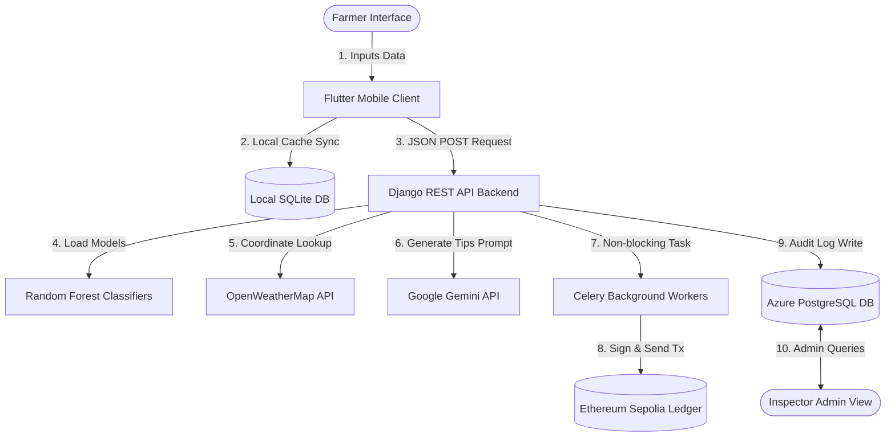

# AgroSmart: Business Requirements Document (BRD)
**Compliance Framework:** ISO 21502:2020 (Requirements Engineering and Scope Baseline Guidelines)  
**Contract Baseline:** Pre-Development Technical Specification  

---

### 1.0 Project Overview & Business Objectives

#### 1.1 Document Purpose & Scope
This Business Requirements Document (BRD) defines the formal, legally binding functional and non-functional requirements for the proposed AgroSmart platform. This document shall serve as the primary specification contract for the engineering team, stakeholders, and the project sponsor before any software development sprint or source code construction begins. All system implementations must be verified and validated against the precise technical baselines established herein.

#### 1.2 Enterprise Business Context
The primary strategic goal of the AgroSmart platform is to resolve the macroeconomic crop yield inefficiencies, soil degradation crises, and resource-allocation deficits that impact regional and smallholder farming portfolios. In modern agricultural systems, the lack of accessible, quantitative diagnostic tools forces farmers to make planting and fertilization decisions based on subjective human intuition or outdated legacy patterns. This results in erratic chemical application, soil acidification, environmental run-off, and crop failure. 

To mitigate these systemic operational risks, the planned platform will deploy an integrated client-server agricultural intelligence solution. The system will feature a high-performance Python Django REST API backend and a cross-platform mobile client built using Flutter to deliver localized, data-driven soil analyses, predictive crop advice, and AI-enabled meteorological tips directly in the field.

#### 1.3 Resource Governance & Funded Tier Structure
The platform shall be built and deployed under a strict, fixed Capital Expenditure (CapEx) threshold of $35,000. Under the governance guidelines of ISO 21502, project resource management is divided into a three-tier structure:
1.  **Strategic & Regulatory Oversight:** Comprises the Project Sponsor (focusing on commercial milestone compliance and budget releases) and the Agricultural Advisory Board (securing scientific model verification and regulatory compliance).
2.  **Core MVP Execution Squad (Funded Tier):** Comprises three dedicated full-time technical resources funded directly by the $35,000 baseline. This squad consists of Muhammad Omer Siddiqui (Engagement Director & Lead Architect), Dr. Elena Rostova (Full-Stack Backend & Data Specialist), and Tariq Mahmood (Frontend Mobile & QA Specialist).
3.  **Subsidized Shared Agency Resource Tier (Scaled Tier):** Comprises specialized software house engineering resources—including Scrum Master Marcus Vance, Backend Developer Alex Mercer, Data Specialist Dr. Sarah Jenkins, Blockchain Developer Kenji Sato, and DevOps Engineer Fatima Al-Sayed. Their operational hours are scaled and subsidized across parallel agency portfolios, maximizing capital utility while providing deep vertical expertise.

---

### 2.0 User Profiles & Demographic Constraints
The planned platform must support two distinct user classes with contrasting technical capabilities and data governance mandates.

#### 2.1 Rural Farmers (End Users)
*   **Demographic Profile & Constraints:**  
    This user group is characterized by limited digital and smartphone literacy, severe budget constraints regarding cellular data traffic, and primary communication reliance on local languages (Urdu). Farmers operate in remote geographic sectors where cellular signals are volatile or entirely unavailable.
*   **System Usability Mandates:**  
    The client-side mobile application must employ a highly accessible, visual interface that utilizes intuitive iconographies, prominent buttons, and glassmorphic layouts to focus user attention. The system must support instant English and Urdu translation string matrices resolved natively on the device hardware to ensure zero latency when changing locales. Additionally, to protect users from cellular data depletion and connectivity dropouts, the mobile application must execute a client-side deterministic fallback engine that computes diagnostics locally without active cloud connections.

#### 2.2 Scientific Review Inspectors & Auditors (Administrative Users)
*   **Demographic Profile & Constraints:**  
    This user group comprises agricultural scientists, government regulatory auditors, and verification inspectors. These users possess high digital literacy and demand absolute data integrity, historical traceability, and high-concurrency request handling.
*   **System Governance Mandates:**  
    Inspectors require the ability to run concurrent queries against the transaction ledger to audit recommendation accuracy, trace advice timestamps, and extract soil parameters. The central database backend must support administrative query interfaces, index-optimized search routines, and cryptographic proof lookups to validate the conformity of recommendations and protect the system from data tampering.

---

### 3.0 Functional Requirements Matrix

| Unique ID | Functional Scope | Detailed System Requirement Specifications | Target User Group | Priority |
| :--- | :--- | :--- | :--- | :--- |
| **BRD-FR-001** | **Native Multi-Language Toggling** | The client application shall support real-time toggling between English and Urdu language string matrices. Language dictionary files must be loaded locally on the device via the localization libraries to execute translation switches without requiring remote database queries. | Rural Farmers | High |
| **BRD-FR-002** | **Low-Spec UI Layout Safety** | To prevent interface rendering collapses on low-specification mobile devices when virtual keyboards are engaged, the mobile client must configure the root Scaffold with a non-resizing layout lock. View-inset offsets must be adjusted manually using dynamic screen height calculations to prevent the keyboard from blocking input fields. | Rural Farmers | High |
| **BRD-FR-003** | **Dual-Model ML Inference** | The planned REST API backend shall ingest soil variables (Nitrogen, Phosphorus, Potassium, temperature, humidity, pH, and rainfall) and execute predictive analysis via two distinct, serialized RandomForestClassifier models. The API must output optimal crop suggestions and fertilizer mixture solutions based on these parameters. | Rural Farmers | High |
| **BRD-FR-004** | **High-Availability Offline Fallback** | If the mobile client experiences a network timeout when querying backend services, it must execute a local deterministic rules engine on the device. This engine will process local weather parameters (precipitation, heat thresholds above 38°C, and humidity above 80%) to generate prescriptive farming advice locally. | Rural Farmers | High |
| **BRD-FR-005** | **Non-Blocking Web3 Ledger Sync** | The backend shall log all recommendation events (query inputs, model outputs, and advice text) to the Ethereum Sepolia network using background asynchronous tasks. This asynchronous structure must execute transaction mining operations outside the primary HTTP request thread, preventing blockchain latency from blocking the mobile client interface. | Scientific Inspectors | Medium |
| **BRD-FR-006** | **Cognitive Advisory Formatting** | The API backend shall connect to Google Gemini Version Two Flash, feed weather parameters into a structured prompt, and parse the response into a rigid four-tier output format: WATERING, FERTILIZER, PEST RISK, and TODAY'S TIP. The parser must discard any response formatting that deviates from this structure. | Rural Farmers | Medium |
| **BRD-FR-007** | **Fuzzy-Text Pesticide Lookup** | The system shall host a pesticide lookup database that maps crop names and symptoms using fuzzy keyword search checks (including blast, brown spot, stem borer, leaf folder, rust, mildew, armyworm, bollworm, whitefly, aphid, leaf miner, fruit borer). If the symptom lookup fails to match, it must return an organic Neem Oil default treatment. | Rural Farmers | Medium |
| **BRD-FR-008** | **Local Database Cache Synchronization** | The mobile client shall maintain a local database helper class that automatically saves the query inputs and diagnostic outputs of the active user. The local cache must support search queries, recent records filtering, and complete user-directed log deletion. | Rural Farmers | Medium |
| **BRD-FR-009** | **User Account Registration** | The system shall support new account registration on the mobile client, enforcing strict client-side verification parameters for passwords, emails, and full names before creating the user record in Firebase. | Rural Farmers | High |
| **BRD-FR-010** | **Session Authentication & Persistent Login** | The mobile application shall maintain secure user sessions, caching authentication tokens locally to allow automatic verification and log the user directly in upon restarting the application. | Rural Farmers | High |
| **BRD-FR-011** | **Soil Diagnostic Guidance Overlay** | The mobile client shall provide a modal guidance overlay on input screens, displaying valid agronomic parameters (including valid range margins for NPK, pH, and precipitation variables) to help users avoid out-of-bound inputs. | Rural Farmers | Medium |
| **BRD-FR-012** | **Advisory Query Detail Expansion** | The history screen shall support detail cards for each past recommendation. Clicking a log card will expand a detailed view displaying the original input metrics and the exact recommendation output. | Rural Farmers | Medium |
| **BRD-FR-013** | **Geographic Coordinates Sourcing** | The mobile client shall request geographic permissions and query the local hardware GPS receiver to extract coordinates for real-time location-based weather advisory requests. | Rural Farmers | High |
| **BRD-FR-014** | **Unified Weather Advisory Dashboard** | The weather dashboard layout shall combine localized meteorological readings (temperature, wind speeds, conditions) with structured, parsed conversational advisory recommendations in a single scrollable panel. | Rural Farmers | Medium |
| **BRD-FR-015** | **Historical Log Searching** | The local database helper shall support query-string keyword searching. Users can input query text to search historical entries by crop, fertilizer, or location names. | Rural Farmers | Medium |
| **BRD-FR-016** | **Historical Log Categorical Filtering** | The history views shall support filter tags allowing the user to display entries by category type (such as displaying only crop recommendations or only weather tips). | Rural Farmers | Medium |
| **BRD-FR-017** | **Session Termination & Account Sign-out** | The settings screen shall support a sign-out trigger. Activating this request will close the Firebase session, erase cached security tokens from local device storage, and clear active UI state logs. | Rural Farmers | High |
| **BRD-FR-018** | **Network State Alerting** | The client application shall monitor device network connection states and render a persistent, non-blocking warning banner when the device goes offline, indicating that queries will use the local fallback engine. | Rural Farmers | Medium |
| **BRD-FR-019** | **Global Staging and Production Endpoint Routing** | The mobile client shall configuration-route all API traffic to either the local development staging endpoint or the Azure production host based on the toggle flag configuration. | Scientific Inspectors | High |
| **BRD-FR-020** | **Ledger Verification Link Generation** | The transaction history card shall capture and store the transaction hash returned by the Sepolia network, rendering a direct hyperlink to the external blockchain explorer. | Scientific Inspectors | Low |

---

### 4.0 Non-Functional Requirements (NFRs)

| NFR Category | Technical Performance & Security Specifications |
| :--- | :--- |
| **Availability & Performance** | The client application shall transition to the local deterministic rules engine in less than 500 milliseconds during network timeout events. The machine learning serialization models must load at Django startup, maintaining prediction response times under 2 seconds. The system must maintain 99.9% uptime. |
| **Data Isolation & Concurrency** | The platform shall maintain complete separation between the database layers: local user histories and offline query caches will run natively on a client-side SQLite file database, while the global audit registry will run on a high-availability Azure PostgreSQL backend to support concurrent inspector administrative queries. |
| **Data Ingestion Integrity** | To prevent execution crashes during model queries, the backend serializers and the mobile form entry fields must strictly mirror the typographical parameters of the training datasets: `'Temparature'` (with 'a' in the second syllable), `'Humidity '` (with trailing space), and `'Phosphorous'` (with 'o' before 'u'). |
| **Security & Local Session Caching** | The client application shall validate passwords using strong registration parameters (length, uppercase, numbers, and symbols) and cache active session keys securely on local hardware to prevent unauthorized offline access. |

---

### 5.0 System Failover & Conflict Governance Protocols

#### 5.1 Web3 Network Latency Failover Protocol
Logging recommendation data to the public Ethereum Sepolia contract via smart contract interactions requires transaction mining times that can range from seconds to several minutes depending on network congestion. To prevent this latency from degrading mobile application performance, the platform will implement the following failover protocol:
1.  **Asynchronous Deferral:** The REST API backend will hand off the blockchain write task to a background worker queue managed by Celery.
2.  **State Registration:** The background worker will write a `'Pending Blockchain Sync'` status flag into the centralized Azure PostgreSQL registry, alongside the transaction payload.
3.  **UI Isolation:** The REST API will immediately return the computed crop, fertilizer, or weather advice to the Flutter mobile client, bypassing any blocking progress indicators.
4.  **DevOps Reporting:** If the transaction fails to mine after three retries (due to network out-of-gas errors or node timeouts), the worker will trigger an automated alert to the DevOps reporting channel (Fatima Al-Sayed) for manual recovery, while the mobile client maintains uninterrupted service.

#### 5.2 Technical Change Escalation Path
To prevent model execution exceptions caused by schema mismatches, any modification impacting database columns, API data payloads, or core parameter spelling conventions—specifically the mandated parameters `'Temparature'`, `'Humidity '`, and `'Phosphorous'`—shall require a formal change request. The modification escalation path requires:
1.  **Validation:** The Data Specialist (Dr. Elena Rostova) must execute data science validation checks confirming that the proposed modification will not cause deserialization or model scoring failures.
2.  **Review:** The Lead Architect (Muhammad Omer Siddiqui) must review the architectural impact of the change on the Django REST framework serializers and the Flutter mobile controllers.
3.  **Sign-off:** The Project Sponsor must provide final written authorization and sign-off before changes are deployed to the production staging environment.

---

### 6.0 User Acceptance Criteria & Verification Standards

To guarantee that each developed module meets the quality thresholds of the enterprise software house, the system must satisfy the following verification metrics prior to deployment:

#### 6.1 Crop & Fertilizer Prediction Verification
*   The Django REST API shall process soil chemical inputs and return crop recommendations that match the agricultural test baseline with an accuracy rating of no less than 92%.
*   The system shall validate data ingestion models to ensure that payloads mapping categorical data (like Soil Type and Crop Type) are parsed correctly without raising HTTP 500 server errors.

#### 6.2 Offline Failover & Latency Audits
*   The mobile client must automatically intercept API timeout exceptions (configured at a maximum ceiling of 5 seconds) and trigger the local rules engine in less than 500 milliseconds.
*   Verification checks will require automated tests simulating network drops during active user forms, confirming that the output conforms to the structured local weather-threshold formats.

#### 6.3 Local Database (SQLite) CRUD Validation
*   The database helper class shall support concurrent database writes from different views without lock exceptions.
*   Data deletion requests from the mobile UI must remove target records from the local storage file, freeing up local memory.

---

### 7.0 Data Governance, Privacy, & Security Standards

The proposed system shall establish strict controls to protect farmer data privacy and comply with regional governance rules:

#### 7.1 User Account Protection & Consent
*   The mobile client shall encrypt all user session tokens using secure device-level storage containers.
*   A formal consent check must be accepted by the user during the first onboarding session to allow location parameters lookup for weather advice.

#### 7.2 Database Access & Security Boundaries
*   All administrative queries originating from Scientific Review Inspectors must be authorized via secure authentication tokens.
*   Direct access to the Azure PostgreSQL database must be restricted behind network security rules, ensuring only the Django REST API backend can establish SQL connections.

---

### 8.0 System Integration, Interfaces, & Data Flow Architecture

The platform's data flow must follow a structured pipeline, ensuring secure communication across all system interfaces:

#### 8.1 API Communication Standards
*   All data transferred between the Flutter mobile client and the Django REST API must be encrypted using secure HTTPS protocols.
*   API request payloads must conform to the strict JSON contracts defined in the project specification documentation, verifying that header types are set to application/json.

#### 8.2 Third-Party Service Interfaces
*   **OpenWeatherMap Interface:** The backend weather client shall query localized weather data by passing latitude and longitude parameters.
*   **Google Gemini Interface:** The generative AI adapter will communicate with the Gemini API to format weather parameters and output structured farming tips.

---

### 9.0 Training, Deployment, & Rollout Requirements

To ensure smooth transition from development to production release, the software house will implement a structured rollout strategy:

#### 9.1 Multi-Language Onboarding Guide
*   The mobile client shall include a visual onboarding layout featuring Urdu and English instructions.
*   A localized help database must be accessible within the settings layout to explain soil parameters (Nitrogen, Phosphorus, Potassium, pH) to non-technical users.

#### 9.2 Staging & Cloud Release Pipelines
*   **Continuous Integration:** The DevOps Engineer (Fatima Al-Sayed) will configure pipelines that automatically run unit tests on Django API endpoints and Flutter code.
*   **Azure Deployment:** Successful tests on the main branch will trigger automated deployment to Microsoft Azure Web Apps.

---

### 10.0 Regulatory Compliance & Legal Framework

The AgroSmart platform must comply with international and regional agricultural data standards:

#### 10.1 ISO 21502:2020 Compliance
*   The project governance model must enforce progress tracking, milestone auditing, and risk mitigation procedures.
*   The Project Manager will conduct bi-weekly audits to align deliverables with the project budget and milestone targets.

#### 10.2 Blockchain Auditing & Legal Disclaimer
*   The smart contract auditing ledger must record recommendations to provide a verified advice history log.
*   The mobile client must display a liability disclaimer indicating that recommendations are generated by machine learning models and local weather rules, advising users to verify results with local extension officers.
