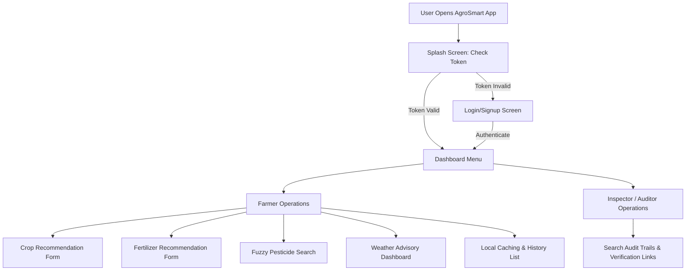
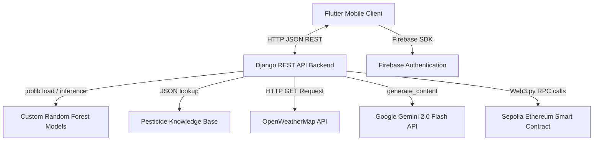
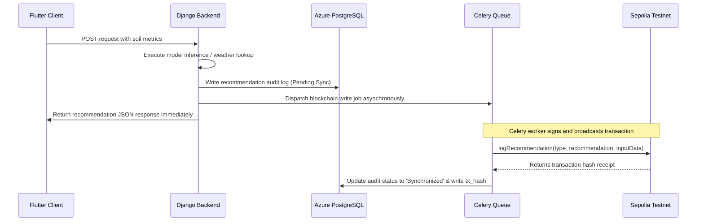
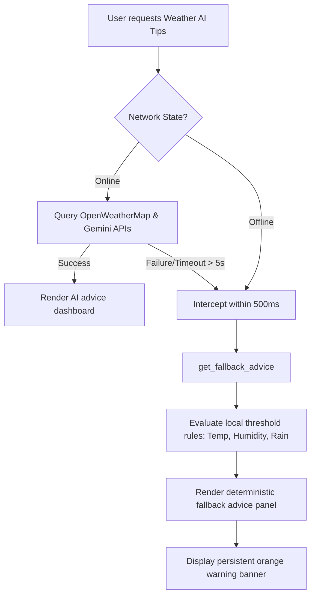

# High-Level Design Document: AgroSmart (Enterprise Agricultural Intelligence Platform)

**Project Name:** AgroSmart (Enterprise Agricultural Intelligence Platform)  
**Document Version:** 1.0  
**Date:** 06/22/2026  

---

### Authors
| Name | Role | Department |
| :--- | :--- | :--- |
| Muhammad Omer Siddiqui | Engagement Director & Lead Architect | Core Architecture & Management |
| Dr. Elena Rostova | Full-Stack Backend & Data Specialist | Backend Engineering |
| Tariq Mahmood | Frontend Mobile & QA Specialist | Mobile UI/UX & Testing |

### Document History
| Date | Version | Document Revision Description | Document Author |
| :--- | :--- | :--- | :--- |
| 06/22/2026 | 1.0 | Initial Functional Specification Baseline | Muhammad Omer Siddiqui |

### Approvals
| Approval Date | Approved Version | Approver Role | Approver |
| :--- | :--- | :--- | :--- |
| 06/22/2026 | 1.0 | Project Sponsor | Client Venture Team |
| 06/22/2026 | 1.0 | Lead Solution Architect | Muhammad Omer Siddiqui |

---

## Table of Contents
1. [Introduction](#1-introduction)
   - 1.1 [Why this High-Level Design Document?](#11-why-this-high-level-design-document)
   - 1.2 [Scope](#12-scope)
   - 1.3 [Definitions](#13-definitions)
   - 1.4 [Overview](#14-overview)
2. [General Description](#2-general-description)
   - 2.1 [Product Perspective](#21-product-perspective)
   - 2.2 [Tools Used](#22-tools-used)
   - 2.3 [General Constraints](#23-general-constraints)
   - 2.4 [Assumptions](#24-assumptions)
   - 2.5 [Special Design Aspects](#25-special-design-aspects)
3. [Design Details](#3-design-details)
   - 3.1 [Main Design Features](#31-main-design-features)
   - 3.2 [Application Architecture](#32-application-architecture)
   - 3.3 [Technology Architecture](#33-technology-architecture)
     - 3.3.1 [Client-Server Architecture](#331-client-server-architecture)
     - 3.3.2 [Presentation Layer](#332-presentation-layer)
     - 3.3.3 [Data Access Layer](#333-data-access-layer)
     - 3.3.4 [Tools Used](#334-tools-used)
   - 3.4 [Standards](#34-standards)
   - 3.5 [Database Design](#35-database-design)
   - 3.6 [Files](#36-files)
   - 3.7 [User Interface](#37-user-interface)
   - 3.8 [Reports](#38-reports)
   - 3.9 [Error Handling](#39-error-handling)
   - 3.10 [Interfaces](#310-interfaces)
   - 3.11 [Help](#311-help)
   - 3.12 [Performance](#312-performance)
   - 3.13 [Security](#313-security)
   - 3.14 [Reliability](#314-reliability)
   - 3.15 [Maintainability](#315-maintainability)
   - 3.16 [Portability](#316-portability)
   - 3.17 [Reusability](#317-reusability)
   - 3.18 [Application Compatibility](#318-application-compatibility)
   - 3.19 [Resource Utilization](#319-resource-utilization)
   - 3.20 [Major Classes](#320-major-classes)

---

## 1. Introduction

### 1.1. Why this High-Level Design Document?
The purpose of this High-Level Design (HLD) Document is to translate the functional and non-functional requirements of the **AgroSmart** platform into a formal software engineering blueprint. It defines the structural layout, component boundaries, database schemas, and external API interfaces for the frontend cross-platform client and Django REST API backend. It acts as the authoritative technical contract to guide implementation and eliminate ambiguities prior to coding.

### 1.2. Scope
This HLD details the architecture for the AgroSmart Minimum Viable Product (MVP) release. The system provides localized crop predictions, fertilizer recommendations, fuzzy pesticide lookup, dynamic weather-based AI advice, offline caching, and asynchronous Web3 transaction auditing.

### 1.3. Definitions
*   **AgroSmart**: The Enterprise Agricultural Intelligence Platform.
*   **RandomForestClassifier**: The machine learning model type used to predict crops (`crop_model.pkl`) and fertilizer needs (`fertilizer_model_final.pkl`).
*   **Sepolia**: The public Ethereum proof-of-stake test network used to log cryptographic audit receipts.
*   **Celery**: An asynchronous distributed task queue used to sign and submit blockchain audits without blocking main thread executions.
*   **easy_localization**: The localization library used to toggle Urdu and English string bundles natively.
*   **Provider**: The state management framework configured in the Flutter mobile application.
*   **Etherscan**: The blockchain explorer used to verify recommendation transaction receipts.
*   **Keychain / Keystore**: The secure device storage systems (iOS / Android) used to encrypt user tokens.

### 1.4. Overview
The HLD will detail:
*   General system constraints, assumptions, and design aspects (e.g. dataset spelling conventions).
*   High-level application architecture and database schema designs (PostgreSQL, SQLite).
*   Core software workflows (machine learning inference, dynamic weather prompting, and async blockchain auditing).
*   Non-functional characteristics including performance thresholds, reliability failovers, and maintainability change escalation pipelines.

---

## 2. General Description

### 2.1. Product Perspective
The AgroSmart platform is structured as a client-server architecture. The frontend is a cross-platform mobile client built with Flutter, and the backend is a Python Django REST API application hosted on Microsoft Azure Web Apps. The Django server interfaces with pre-trained RandomForest models, a PostgreSQL audit log database, OpenWeatherMap API, Google Gemini 2.0 Flash API, and Infura Sepolia Ethereum RPC nodes.

The system supports two user pathways:
1.  **Rural Farmer**: Standard authenticated access to all crop/fertilizer inputs, fuzzy pesticide database searching, local offline weather fallbacks, and local history tracking.
2.  **Scientific Review Inspector / Auditor**: Administrative read-only access to transaction history search queries and external Etherscan validation links.

### 2.2. Tools Used
1.  **Flutter SDK**: Mobile client framework running on iOS (15.0+) and Android (API 28+).
2.  **Django REST Framework (DRF)**: Python backend routing REST JSON requests.
3.  **joblib & scikit-learn**: Python libraries to load and execute pre-trained RandomForest classification files.
4.  **Celery & Redis**: Background worker queue and broker to offload Web3 transaction signing.
5.  **Azure Web Apps & PostgreSQL**: Production hosting server and transactional database database storage.
6.  **SQLite Helper**: Native local client relational caching table for offline access.
7.  **Infura / Web3.py**: Blockchain connection wrapper to interact with Sepolia smart contracts.
8.  **easy_localization**: Native localization package for English/Urdu translation files.
9.  **Firebase Authentication SDK**: Authentication broker for secure registration and login.
10. **Google Gemini 2.0 Flash API**: Generative cognitive engine for structured weather tips.

### 2.3. General Constraints
*   **Budget Bounding**: Total development, gas fees, and deployment costs are constrained under a fixed CapEx limit of **$35,000**.
*   **Layout Safety Constraints**: Mobile forms must utilize non-resizing root layouts (`resizeToAvoidBottomInset: false` on Scaffold) to prevent input card collapses, handling soft keyboard view-insets manually.
*   **Dataset Spelling Conventions**: Form inputs and database model schema serializers must strictly mirror dataset typographical quirks (`Temparature` (misspelled), `Humidity ` (trailing space), and `Phosphorous` (misspelled)) to prevent ML model evaluation failures.

### 2.4. Assumptions
*   **Hardware Sensors**: Target user mobile devices possess functioning internal GPS modules and flash storage.
*   **Dataset Lock-In**: Pre-trained model structures are static MVP assets, meaning their feature definitions and conventions will not be altered without structural change escalation approvals.
*   **API Accessibility**: Cloud gateways retain access to OpenWeatherMap and Sepolia Infura endpoints.

### 2.5. Special Design Aspects
A key design aspect is the separation of real-time server-based ML model predictions from background blockchain audits. Network transaction signing is offloaded to Celery background tasks, allowing the Django API to return the recommendation immediately to the Flutter client.

---

## 3. Design Details

### 3.1. Main Design Features
The primary design details focus on three aspects: the system architecture layers, the database schema configurations, and the dynamic execution pipelines (asynchronous ledger writes and high-availability offline rules engines).

### 3.2. Application Architecture
The system supports distinct pathways for the two types of user personas:



### 3.3. Technology Architecture

#### 3.3.1. Client-Server Architecture
The interaction model between the client, backend, machine learning models, external services, and the blockchain is visualized below:



#### 3.3.2. Presentation Layer
The Flutter presentation layer uses the **Provider** state management pattern to trigger data loads and maintain state. The views utilize Frosted Glassmorphism overlays and custom language switchers that natively resolve English ('en') and Urdu ('ur') locale bundles.

#### 3.3.3. Data Access Layer
Data is structured across two boundaries:
*   **Client SQLite Storage**: Relational tables caching user diagnostic queries locally on the device.
*   **Server Azure PostgreSQL Database**: The centralized database database storage logging global telemetry audits and background celery states.

---

### 3.4. Standards
*   **Communication Protocol**: Secure HTTPS using standardized JSON payload headers:
    ```json
    {
      "Content-Type": "application/json",
      "Accept": "application/json"
    }
    ```
*   **Smart Contract Interface**: The logged audits are compiled using the Ethereum ABI structure, calling the `logRecommendation(string type, string recommendation, string inputData)` contract function.

---

### 3.5. Database Design

#### 3.5.1 PostgreSQL Global Audit Schema
Used by the backend to log recommendation transactions and sync statuses:
```sql
CREATE TABLE recommendation_audit_log (
    id SERIAL PRIMARY KEY,
    user_id VARCHAR(128) NOT NULL,
    query_type VARCHAR(64) NOT NULL,
    input_payload JSONB NOT NULL,
    output_result JSONB NOT NULL,
    blockchain_tx_hash VARCHAR(66),
    sync_status VARCHAR(32) DEFAULT 'Pending Sync',
    timestamp TIMESTAMP DEFAULT CURRENT_TIMESTAMP
);
```

#### 3.5.2 SQLite Client Cache Schema
Used on the mobile device to save diagnostic queries for offline access:
```sql
CREATE TABLE diagnostic_history (
    id INTEGER PRIMARY KEY AUTOINCREMENT,
    user_id TEXT NOT NULL,
    query_type TEXT NOT NULL, -- 'crop', 'fertilizer', 'pesticide', 'weather'
    inputs TEXT NOT NULL,     -- JSON stringified inputs
    outputs TEXT NOT NULL,    -- JSON stringified results
    tx_hash TEXT,             -- Sepolia transaction hash
    sync_status TEXT NOT NULL,-- 'Synchronized' or 'Pending Sync'
    timestamp DATETIME DEFAULT CURRENT_TIMESTAMP
);
```

---

### 3.6. Files
*   **ML Model Files**: 
    *   `crop_model.pkl` (Random Forest model) and `crop_label_encoder.pkl` (Categorical output decoder).
    *   `fertilizer_model_final.pkl` (Fertilizer Random Forest model).
    *   `fertilizer_target_encoder_final.pkl`, `fertilizer_encoder_Soil_Type.pkl`, and `fertilizer_encoder_Crop_Type.pkl` (encoders).
*   **Localization Assets**: `en.json` and `ur.json` translation files inside the Flutter bundle assets.

---

### 3.7. User Interface
The UI comprises 9 primary screen layouts defined in the FSD:
1.  **Splash Screen**: Loads settings and secure keys; checks cached Firebase credentials.
2.  **Login & Registration Screen**: Frosted glass card, English/Urdu switch, Firebase input validations, and keyboard-safe padding.
3.  **Home Dashboard**: Central operations hub; shows query badge metrics and network warning banner.
4.  **Crop Recommendation Form**: Ingests N, P, K, pH, temp, humidity, and rainfall; triggers range safety guides.
5.  **Fertilizer Advisory Form**: Categorical soil/crop selectors and nutrient text fields matching dataset typos.
6.  **Pesticide Diagnosis Form**: Autocomplete crop name and symptom description text area.
7.  **Weather Smart Screen**: GPS coordinate tracker with manual city coordinate overrides.
8.  **Diagnostic Results Screen**: Displays recommended results, structured weather details, and transaction hashes.
9.  **Historical Audit Registry**: Filterable, keyword-searchable history index with swipe-to-delete gestures.

---

### 3.8. Reports
The backend generates administrative query reports for Scientific Review Inspectors. Inspectors can retrieve global transaction histories, filter records by date ranges or query type, and access transaction hyperlinks to verify recommendation integrity on Sepolia.

---

### 3.9. Error Handling
Third-party integration exceptions are caught and logged under designated IDs:
*   **`ERR-INT-101` (OpenWeatherMap Failure)**: Timeout or API key failure; backend triggers mock fallback values for Islamabad and logs warning.
*   **`ERR-INT-102` (Gemini API Limit reached)**: Out of quota; client interceptor redirects to local `get_fallback_advice()`.
*   **`ERR-INT-103` (Web3 Sync Latency / Gas Failure)**: Worker retries Web3 signing up to 3 times before updating state to `'Pending Blockchain Sync'` and raising alert to DevOps.
*   **`ERR-INT-104` (Typo Serializer Error)**: Mismatch in expected spellings; serializer intercepts input data and forces realignment checks.

---

### 3.10. Interfaces
*   **Hardware Interface**: 
    *   **GPS Receiver**: Extracts live coordinate variables (`lat`, `lon`).
    *   **Keystore / Keychain**: Encrypts JWT secure session tokens locally.
*   **Software Interface**:
    *   **OpenWeatherMap**: REST HTTP endpoint proxying weather conditions.
    *   **Google Gemini**: Cognitive formatting parser enforcing standard advising outputs.
    *   **Sepolia Ethereum RPC Node**: Auditing blockchain ledger.

---

### 3.11. Help
*   **Visual Training Modules**: In-app step-by-step guides explaining soil extraction and inputs mapping in English and Urdu.

---

### 3.12. Performance
*   **Inference Latency**: Django REST model calculations must return outputs in under 2.0 seconds.
*   **SQLite Caching speed**: Mobile database cache writes and searches must complete in under 100ms.
*   **Offline Transition**: Offline status banner warning and local rules calculations must trigger in under 500ms.

---

### 3.13. Security
*   **Token Encryption**: Secure local storage encrypts authentication tokens.
*   **Password Complexity**: Account registration blocks credentials failing criteria checks (minimum 8 characters, uppercase, number, symbol).
*   **Data Isolation**: Client-side database tables are sandboxed within the application directory and are inaccessible to other external software.

---

### 3.14. Reliability

#### 3.14.1 Asynchronous Blockchain Syncing Pipeline
To prevent blockchain mining latency from blocking mobile UI threads, Web3 writing utilizes Celery workers:



#### 3.14.2 High-Availability Offline Rules Engine
If network dropouts occur or the cloud API times out (exceeding 5 seconds), client-side interceptors call `get_fallback_advice()` within 500ms using deterministic local rules:



*   **Deterministic Thresholds**:
    *   *Rain / Thunderstorm*: watering = "No", fertilizer = "Wait", pest = "Medium", tip = "Cover sensitive crops".
    *   *Temp > 38°C*: watering = "Yes", fertilizer = "Wait - Heat causes burn", pest = "High", tip = "Provide shade".
    *   *Humidity > 80%*: watering = "No", fertilizer = "Wait - risk of fungus", pest = "High - fungal risk", tip = "Ensure good air circulation".

---

### 3.15. Maintainability

#### 3.15.1 Technical Change Escalation Path
To prevent validation exceptions and schema mismatches between client forms, database columns, and ML training sets (such as the non-standard fields `'Temparature'`, `'Humidity '`, and `'Phosphorous'`), any proposed schema changes must follow this approval path:
1.  **Data Science Verification**: Dr. Sarah Jenkins verifies that changes do not impact machine learning performance.
2.  **Django Serializer Realignment**: Dr. Elena Rostova updates backend API models and validation rules.
3.  **Client-Side Parity Check**: Lead Architect Muhammad Omer Siddiqui updates Flutter input controllers.
4.  **Project Sponsor Sign-Off**: Final approval from the Project Sponsor before deploying changes to staging.

#### 3.15.2 Alerting Rules
The PostgreSQL database logger catches third-party exceptions. If Sepolia RPC connection drops persist beyond 3 retries, Celery triggers automated Slack alerts to the DevOps channel (Fatima Al-Sayed).

---

### 3.16. Portability
The compiled Flutter application runs natively across iOS (15.0+) and Android (API 28+). The Django REST API uses dockerized containers to ensure seamless deployment and environment replication between Azure Staging and Azure Production Web App slots.

---

### 3.17. Reusability
Modular elements are decoupled:
*   The `RandomForest` inference helper wrapper operates independently of REST API endpoints.
*   The SQLite helper class functions as an isolated caching wrapper, allowing it to be reused for different transactional views.

---

### 3.18. Application Compatibility
The system ensures backward compatibility for mobile clients by isolating ML configuration models:
*   The ML endpoint schema versioning allows newer Random Forest models to be loaded dynamically from standard `.pkl` files without requiring mobile client updates.

---

### 3.19. Resource Utilization
*   **Thread Responsiveness**: Frontend calculations offload complex parsing to async isolates to prevent frame drops.
*   **Database Locks**: PostgreSQL transactions use explicit JSONB columns to avoid table locking during high-concurrency inspector audits.

---

### 3.20. Major Classes
*   **`AuthService`**: Coordinates Firebase login, signup, and local session key caching.
*   **`ApiService`**: Dispatches HTTP JSON requests and handles base URL toggling (`useLocalBackend`).
*   **`DatabaseHelper`**: Manages SQLite cache connections and query transactions.
*   **`RandomForestClassifier`**: Models predictions based on soil inputs.
*   **`WeatherLLMManager`**: Fetches weather metrics and parses Gemini cognitive advices.
*   **`BlockchainWorker`**: signs Ethereum payloads and broadcasts audit logs via Infura RPC.
