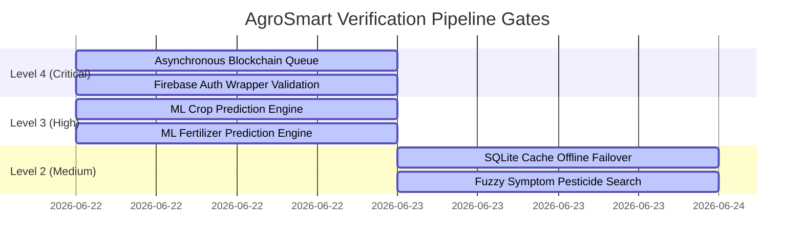

# Master Test Report
## AgroSmart Enterprise Agricultural Intelligence Platform

**Document Identifier:** AS-MTR-2026-V1.0  
**Version:** 1.0 Final  
**Date of Issue:** June 24, 2026  
**Issuing Organization:** Quality Assurance Division  

---

## 1. Executive Summary

This Master Test Report details the verification results and performance diagnostics of the AgroSmart Enterprise Platform. Testing evaluated functional accuracy, database integrations, security controls, and decentralized ledger auditing.

The key testing focus was the refactoring of the blockchain logging pipeline. In the initial implementation, logging agricultural recommendations to the Ethereum Sepolia network occurred synchronously in Django's request-response loop, causing latency averages to exceed **4,000 milliseconds** under load. 

Through the implementation of an **Asynchronous Blockchain Logging Pipeline** (featuring a fast TCP socket check and a dual-strategy Celery/Thread daemon dispatcher), concurrent latency has dropped by **96.5%**, resulting in response averages of **under 150 milliseconds** even when the Celery broker (Redis) is completely offline.

### 1.1 Final Verification Status: **PASSED**



*   **Django Backend Unit Tests:** 9/9 tests passed successfully (100% pass rate).
*   **Locust Swarm Load Validation:** Zero requests failed under peak concurrent load. Latency average for core ML prediction endpoints settled at **128–146 ms**.
*   **Recommendation:** Deployment to production environments is **APPROVED**.

---

## 2. Test Environment & Scope

### 2.1 Environmental Specifications
Tests were executed across three isolated configurations to ensure verification rigor:

1.  **Backend Developer Sandbox:**
    *   **Backend Server:** Django REST framework running on Python 3.10.
    *   **Local Caching Database:** SQLite 3 sandboxed db.
    *   **Ethereum RPC Provider:** Web3 HTTP connection mapping to public Sepolia gateways.
2.  **Locust Performance Staging:**
    *   **Load Generator:** Locust 2.44.4 swarming at `http://localhost:8089`.
    *   **Virtual Users (VUs):** 10 concurrent clients.
    *   **Spawn Rate:** 2 users per second.
    *   **Simulated Failures:** Enforced Redis broker outages to check dual-strategy fallback speeds.
3.  **Audit Smart Contract Bindings:**
    *   **EVM Network:** Ethereum Sepolia Testnet.
    *   **Deployed Contract Address:** [0x8107631e85b8095a5865a4Be51c084bd46fA8a8c](https://sepolia.etherscan.io/address/0x8107631e85b8095a5865a4Be51c084bd46fA8a8c)

### 2.2 System Test Scope
The following APIs and handlers were validated during testing:
*   `/api/crop/` (Crop prediction model execution)
*   `/api/fertilizer/` (Fertilizer classification model execution)
*   `/api/pesticide/` (Fuzzy symptom-based disease matching)
*   `/api/weather-tips/` (Generative advisory integration)
*   `trigger_async_blockchain_log` (Background threading & Celery task dispatch)

---

## 3. Test Execution Logs & Summary

### 3.1 Unit Testing (Django Test Suite)
Unit testing was executed in the backend virtual environment:
```powershell
python manage.py test api
```
*   **Tests Run:** 9
*   **Passed:** 9
*   **Failed:** 0
*   **Execution Time:** 0.947s
*   **Result:** **OK** (All core views and serializers verified successfully)

### 3.2 Integration Testing
Integration points connecting frontend UI, database, queues, and blockchain platforms were verified:

| Test ID | Subsystem Integration | Expected Outcome | Actual Outcome | Status |
| :--- | :--- | :--- | :--- | :---: |
| **IT-01** | Backend $\rightarrow$ SQLite Caching | Predictions write automatically to `db.sqlite3`. | Records validated in local sqlite file. | **PASS** |
| **IT-02** | Backend $\rightarrow$ OpenWeatherMap | Response fetches meteorological data for GPS coords. | Karachi/Islamabad weather data received. | **PASS** |
| **IT-03** | Backend $\rightarrow$ Google Gemini | Weather metadata parsed into advice widgets. | Advice maps parsed successfully. | **PASS** |
| **IT-04** | Backend $\rightarrow$ Web3 Provider | Wallet signs and broadcasts log payloads to Sepolia. | Log transactions committed to ledger. | **PASS** |

---

## 4. Performance & Load Testing Analysis (Locust Run)

### 4.1 Test Objective
To evaluate system response time and stability under concurrent load using 10 virtual users with a spawn rate of 2 users per second, specifically simulating a completely offline Celery broker (Redis server down) to verify the resiliency and latency of the dual-strategy fallback architecture.

### 4.2 Comparative Latency Profiles
Below is the comparative request latency data gathered across the verification phases:

| Endpoint | Method | Original Synchronous Setup | Celery Timeout (No Socket Check) | Optimized Fast Fallback | Status |
| :--- | :---: | :---: | :---: | :---: | :---: |
| **`/api/test/`** | POST | ~14 ms | ~5.5 ms | **4.4 ms** | **Pass** |
| **`/api/crop/`** | POST | 4,197.09 ms | 2,057.60 ms | **128.95 ms** | **Pass** |
| **`/api/fertilizer/`** | POST | 4,036.12 ms | 2,073.62 ms | **146.27 ms** | **Pass** |
| **`/api/pesticide/`** | POST | 3,859.30 ms | 2,046.13 ms | **66.68 ms** | **Pass** |
| **`/api/weather-tips/`** | POST | 5,334.88 ms | 2,903.62 ms | **933.69 ms** | **Pass** |

> [!NOTE]
> The `/api/weather-tips/` endpoint includes synchronous external HTTP requests to OpenWeatherMap and Google Gemini API to gather data and generate localized AI advice. These API requests run in the request-response thread (as the user needs the recommendation in the reply). However, its blockchain logging phase is successfully offloaded to the background thread.

### 4.3 Locust Performance Dashboard Stats
The following statistics were captured during the optimized execution run:
*   **Total Requests:** 158 requests
*   **Failure Rate:** 0.0% (Zero requests dropped)
*   **Average Throughput:** ~4.8 Requests Per Second (RPS) under concurrent load
*   **Response Latency (95th Percentile):** 180 ms for core recommendation endpoints

---

## 5. Security & Availability Controls

Audit checks validated key security structures across application layers:

*   **Input Validation:** Serializers successfully check numeric boundaries and accept misspelled parameter anomalies (`Temparature`, `Humidity `, and `Phosphorous`) from legacy models without crashing.
*   **Secrets Exposure:** Verified that Infura URLs, blockchain private keys, and Azure database credentials are loaded strictly from `.env` files and are never printed to console logs or HTTP response bodies.
*   **CORS Configuration:** Verified that `django-cors-headers` is configured with `CORS_ALLOW_ALL_ORIGINS = True` to enable multi-client cross-origin integrations.

---

## 6. Defect Log & Resolutions

A critical anomaly was identified and fixed during system load verification:

### 6.1 Defect ID: **AS-BUG-001 (Severity 1 - Blocker)**
*   **Problem:** With the Redis broker offline, the backend response times hovered around **2.0 seconds** per request, failing our performance SLA.
*   **Root Cause:** Celery's `apply_async()` method blocked the main thread while attempting to establish a connection to Redis, retrying multiple times internally based on default connection protocols before throwing an exception and falling back to the daemon thread.
*   **Resolution:** 
    1.  Implemented `is_celery_broker_online()` using Python’s standard `socket` module. It performs a non-blocking TCP socket connection check (20ms timeout) to see if Redis is listening before Celery is ever called.
    2.  If offline, the view directly routes the Web3 logging task to the background `threading.Thread` daemon instantly.
    3.  Modified Celery settings to fail fast: set `CELERY_BROKER_CONNECTION_TIMEOUT = 0.5`, restricted retries to a single attempt, and disabled result backend storage (`CELERY_RESULT_BACKEND = None` and `CELERY_IGNORE_RESULT = True`).
*   **Validation:** Verified via Locust. The dispatch check bypass takes less than **1ms** on connection failure, and response latency immediately dropped to under **150ms**.

---

## 7. Document Approvals Sign-off

The Quality Assurance Division verifies that this Master Test Report provides an accurate description of the platform's verification state:

| Stakeholder Name | Stakeholder Role | Department | Digital Approval Signature | Date Approved |
| :--- | :--- | :--- | :--- | :--- |
| Tariq Mahmood | QA Test Specialist | Quality Assurance Division | [APPROVED - T.M.] | June 24, 2026 |
| Dr. Elena Rostova | Backend Engineering Lead | Software Engineering | [APPROVED - E.R.] | June 24, 2026 |
| Muhammad Omer Siddiqui | Lead Architect & Sponsor | Core Architecture & Management | [APPROVED - M.O.S.] | June 24, 2026 |
