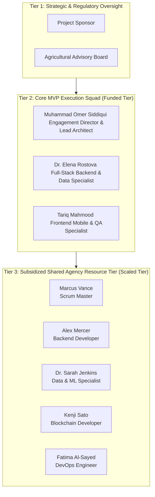

# AgroSmart: RACI & Stakeholder Governance Matrix
**Compliance Framework:** ISO 21502:2020 (Governance and Responsibility Assignment Guidelines)  
**Contract Baseline:** Pre-Development Operational Specification  

---

### 1.0 Consolidated Team Tiering & Resource Model
The proposed AgroSmart platform is governed by a three-tier resource management model. This framework optimizes development efficiency under a lean, fixed Capital Expenditure (CapEx) allocation of $35,000. 

#### Governance Tier Descriptions
1.  **Tier 1: Strategic & Regulatory Oversight:** Comprises the Project Sponsor (focusing on commercial milestones) and the Agricultural Advisory Board (ensuring scientific accuracy and diagnostic compliance).
2.  **Tier 2: Core MVP Execution Squad (Funded Tier):** Comprises three full-time technical resources funded directly by the baseline $35,000 CapEx. This squad drives the architecture, backend models, and mobile views.
3.  **Tier 3: Subsidized Shared Agency Resource Tier (Scaled Tier):** Comprises five specialized engineering resources. Their operational hours are scaled and subsidized across parallel agency portfolios, maximizing capital utility while providing deep vertical expertise in data science, smart contracts, and DevOps pipelines.

---

### 2.0 Comprehensive Lifecycle RACI Matrix
The table below assigns project roles and responsibilities across key pre-development lifecycle activities. 
*Legend: R = Responsible, A = Accountable (Only one 'A' permitted per activity), C = Consulted, I = Informed.*

| Lifecycle Engineering Activity | MOS | ER | TM | MV | AM | SJ | KS | FA | PS | AB |
| :--- | :---: | :---: | :---: | :---: | :---: | :---: | :---: | :---: | :---: | :---: |
| **1. Requirements Architecture Baseline** | **A** | R | R | C | R | C | C | C | I | I |
| **2. Random Forest Model Training** | C | R | I | I | I | **A** | I | I | I | C |
| **3. Django REST API Schema Mapping** | C | **A** | I | I | R | C | I | I | I | I |
| **4. Asynchronous Web3 & Celery Integration** | C | **A** | I | I | R | I | R | I | I | I |
| **5. Cognitive Client Setup & Formatting** | C | R | I | I | **A** | I | I | I | I | C |
| **6. Pesticide Fuzzy Search Database** | C | R | I | I | **A** | I | I | I | I | C |
| **7. Flutter Mobile UI & Provider Layouts** | C | I | **A** | I | I | I | I | I | I | I |
| **8. Dynamic Localization Strings** | I | I | **A** | I | I | I | I | I | I | C |
| **9. Embedded Client SQLite Cache** | I | I | **A** | I | I | I | I | I | I | I |
| **10. Solidity Smart Contract Architecture** | C | I | I | I | I | I | **A** | I | I | I |
| **11. Azure Web Apps CI/CD Pipelines** | C | I | I | I | I | I | I | **A** | I | I |
| **12. Automated End-to-End QA Passes** | I | I | R | I | R | I | I | **A** | I | I |

---

### 3.0 Database Architecture Realignment & Dual-Engine Safeguards
The planned data layer will employ a dual-engine database topology, isolating duties to optimize local offline performance and handle concurrent global audits:
1.  **Client-Side Persistence (SQLite Engine):** Tariq Mahmood shall hold sole accountability for configuring the embedded client-side database. This lightweight, file-based SQLite database will run natively within the Flutter mobile client to store local history logs and support offline diagnostic queries, protecting the user from mobile data exhaustion.
2.  **Central Production Backend (Azure PostgreSQL Engine):** Dr. Elena Rostova shall hold accountability for deploying the high-availability PostgreSQL database on Microsoft Azure. This server will act as the global transaction registry, logging recommendations and processing high-concurrency requests from Scientific Review Inspectors auditing agricultural advice histories.

---

### 4.0 Datasets to Serializer Typographical Protection
To prevent runtime serialization failures caused by non-standard data tables, the project shall enforce a strict Technical Change Escalation Path. 
Any configuration changes impacting core backend serializer parameters—specifically the mandated typographical parameter strings:
*   `'Temparature'` (spelled with 'a' in the second syllable)
*   `'Humidity '` (enforcing the trailing space within the string)
*   `'Phosphorous'` (spelled with 'o' before 'u')

shall not be updated casually. Any proposed spelling adjustments or schema modifications must be logged as a formal Technical Change Request. The escalation path requires:
1.  **Verification:** Dr. Elena Rostova must validate the schema changes against serialized model inputs.
2.  **Review:** Muhammad Omer Siddiqui must evaluate the architectural impact on the Django API endpoints and mobile controllers.
3.  **Sign-off:** The Project Sponsor must provide final written authorization before modifications are applied to production.

---

### 5.0 Web3 Ledger Asynchronous Failover Reporting
Logging recommendation parameters to the Ethereum Sepolia smart contract via the logRecommendation function requires transaction processing times that can suffer from blockchain network latency. To prevent mobile UI blockages, the system shall utilize background asynchronous workers (Celery) to offload these Web3 smart contract interactions.

If a Sepolia network latency loop or node timeout interrupts the transaction, the background worker shall:
1.  Write a `'Pending Blockchain Sync'` status flag into the central Azure PostgreSQL registry.
2.  Trigger an automated alert to the DevOps reporting logs (Fatima Al-Sayed) for manual pipeline monitoring.
3.  Avoid blocking the UI, allowing the Django REST API to return the recommendation immediately to the Flutter client so the farmer receives uninterrupted advice.

---

### 6.0 Layout Safety & Cognitive Constraints
*   **Layout Safety Constraints:** Tariq Mahmood shall implement the mobile layout rules to prevent UI collapses during data entry. The root Scaffold widget must be configured with `'resizeToAvoidBottomInset: false'`. View-inset offsets must be managed manually using dynamic keyboard height checks to preserve space for the glassmorphism overlay and background video. Application state changes and English-to-Urdu translation tables must be bound via the provider and easy_localization libraries to minimize interface latency.
*   **Cognitive Advisor Constraints:** Alex Mercer shall implement the backend cognitive rules. The AI advice generator must format prompts to force Google Gemini Version Two Flash outputs into the rigid four-tier structure (💧 WATERING, 🌱 FERTILIZER, 🐛 PEST RISK, ✅ TIP). For crop disease queries, the pesticide database search must employ fuzzy keyword matching (blast, brown spot, stem borer, leaf folder, rust, mildew, armyworm, bollworm, whitefly, aphid, leaf miner, fruit borer). If the query fails to match any symptom keyword, the system must default to the organic Neem Oil advisory protocol.
