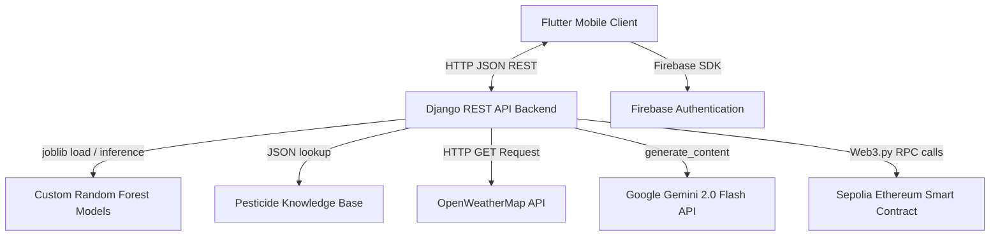

# AgroSmart: Deep Technical Specification & Architecture Context

This document provides a highly detailed, "holy shit" level blueprint of the **AgroSmart** system. It is designed to give AI coding assistants precise, unambiguous context regarding the databases, machine learning model serialization quirks, API contracts, blockchain interfaces, and frontend design patterns.

---

## 1. System Architecture Overview

AgroSmart utilizes a client-server architecture split into a cross-platform mobile frontend and a Python-based REST backend.



### Server Environments (`api_service.dart`)
The frontend points to one of two environments depending on the state of the toggle flag `useLocalBackend`:
*   **Local Backend**: `http://127.0.0.1:8000/api`
*   **Production Backend**: `https://agrosmart-app-service-bcg4hadja2e0ddhe.southeastasia-01.azurewebsites.net/api`

---

## 2. Machine Learning Specifications

AgroSmart uses two separate pre-trained `RandomForestClassifier` models built using `scikit-learn` and loaded via `joblib`.

### A. Crop Recommendation Model
*   **Model File**: `crop_model.pkl` (loaded from `api/crop_model.pkl`)
*   **Encoder File**: `crop_label_encoder.pkl`
*   **Training Script**: [train_crop_model.py](file:///c:/Users/Admin/.gemini/antigravity-ide/scratch/agrosmart/agrosmart-backend/train_crop_model.py)
*   **Expected Features (Ordered)**:
    1.  `N` (Nitrogen): `float` (Typical range: `0 - 140`)
    2.  `P` (Phosphorus): `float` (Typical range: `0 - 145`)
    3.  `K` (Potassium): `float` (Typical range: `0 - 205`)
    4.  `temperature`: `float` in Celsius (`0 - 50`)
    5.  `humidity`: `float` percentage (`0 - 100`)
    6.  `ph`: `float` soil acidity (`0 - 14`)
    7.  `rainfall`: `float` precipitation in mm (`0 - 300`)
*   **Target Output**: One of the unique encoded crops classes (e.g., *rice, maize, chickpeas, kidneybeans, pigeonpeas, mothbeans, mungbean, blackgram, lentil, pomegranate, banana, mango, grapes, watermelon, muskmelon, apple, orange, papaya, coconut, cotton, jute, coffee*).

### B. Fertilizer Prediction Model (Critical Quirks!)
The dataset used to train the fertilizer model has several **non-standard spellings, trailing spaces, and capitalization patterns**. Both frontend forms and backend serializers must mirror these typos exactly to avoid key mapping exceptions:
*   **Model File**: `fertilizer_model_final.pkl`
*   **Encoders**: 
    *   `fertilizer_target_encoder_final.pkl` (target labels mapping back to fertilizer names like *Urea, DAP, 28-28, 14-35-14, 17-17-17, 20-20, 10-26-26*)
    *   `fertilizer_encoder_Soil_Type.pkl` (categorical encoder for Soil)
    *   `fertilizer_encoder_Crop_Type.pkl` (categorical encoder for Crops)
*   **Training Script**: [train_fertilizer_final.py](file:///c:/Users/Admin/.gemini/antigravity-ide/scratch/agrosmart/agrosmart-backend/train_fertilizer_final.py)
*   **Expected Features (Ordered & Spelled Exactly)**:
    1.  `Temparature`: `float` (**Note the misspelling with 'a' instead of 'e'**)
    2.  `Humidity `: `float` (**Note the trailing space inside the string!**)
    3.  `Moisture`: `float`
    4.  `Soil Type`: `string` (must be encoded to int via `Soil_Type` encoder)
    5.  `Crop Type`: `string` (must be encoded to int via `Crop_Type` encoder)
    6.  `Nitrogen`: `float`
    7.  `Potassium`: `float`
    8.  `Phosphorous`: `float` (**Note the spelling with 'o' before 'u'**)
*   **Supported Soil Types**: `Sandy`, `Loamy`, `Black`, `Red`, `Clayey`
*   **Supported Crop Types**: `Maize`, `Sugarcane`, `Cotton`, `Tobacco`, `Paddy`, `Wheat`, `Barley`

---

## 3. Pesticide Knowledge Base (`pesticide_knowledge.py`)

A static knowledge matrix maps crops and key diagnosis keywords to treatments:
*   **File Location**: [pesticide_knowledge.py](file:///c:/Users/Admin/.gemini/antigravity-ide/scratch/agrosmart/agrosmart-backend/api/pesticide_knowledge.py)
*   **Fuzzy Mapping Rules**:
    *   Crops like `tomato`, `potato`, `brinjal`, `chili`, `onion`, `garlic` are automatically mapped to a generic `"vegetable"` category.
    *   Problem symptoms are parsed using keywords: `blast`, `brown spot`, `stem borer` (also matches `borer`), `leaf folder`, `rust`, `mildew` (matches `powdery mildew`), `armyworm`, `bollworm`, `whitefly`, `aphid`, `leaf miner`, `fruit borer`.
    *   If no keyword matches, the system splits the query and searches utilizing the first three words.
*   **Fallback Default**: If all matches fail, it returns an organic default treatment:
    ```json
    {
      "pesticide": "Neem Oil (Organic)",
      "dosage": "5ml per liter water",
      "method": "Foliar spray (cover all plant parts)",
      "frequency": "Every 7 days until problem resolves",
      "note": "For specific diagnosis, consult local agricultural extension officer"
    }
    ```

---

## 4. Weather & LLM Advice Engine (`weather_service.py`)

This service uses external APIs to fetch real-time location data and feed it into Google's Gemini LLM.

*   **File Location**: [weather_service.py](file:///c:/Users/Admin/.gemini/antigravity-ide/scratch/agrosmart/agrosmart-backend/api/weather_service.py)
*   **OpenWeatherMap Connection**: Connects to `https://api.openweathermap.org/data/2.5/weather` using coordinates (`lat`, `lon`). If no key is set or the query fails, it returns mock data for Islamabad (`30.0°C`, `50% humidity`, `clear sky`).
*   **LLM Model Used**: `models/gemini-2.0-flash`
*   **Prompt Specification**:
    ```text
    You are an agricultural expert advising a farmer in {location} growing {crop_type or 'crops'}.
    Weather: {temp}°C, {humidity}% humidity, {conditions}, wind {wind_speed} m/s.
    Give VERY SHORT advice in EXACT format:
    💧 WATERING: (Yes/No) - (4-5 words reason)
    🌱 FERTILIZER: (Good/Wait) - (4-5 words reason)
    🐛 PEST RISK: (Low/Medium/High) - (3-4 words)
    ✅ TIP: (one 5-8 word sentence)
    ```
*   **High-Availability Offline Fallback**:
    If the Gemini quota is exceeded or the network times out, the code passes the weather context to `get_fallback_advice()`, which applies strict deterministic threshold rules:
    *   `rain` or `thunderstorm` in conditions -> watering = "No", fertilizer = "Wait", pest = "Medium", tip = "Cover sensitive crops".
    *   `temp > 38°C` -> watering = "Yes - Extreme heat!", fertilizer = "Wait - Heat causes burn", pest = "High - mites", tip = "Provide shade".
    *   `humidity > 80%` -> watering = "No", fertilizer = "Wait - risk of fungus", pest = "High - fungal risk", tip = "Ensure good air circulation".
    *   Crop-specific rules are attached for `rice`, `wheat`, `maize`, and `cotton`.

---

## 5. Blockchain Smart Contract Integration (`blockchain_service.py`)

AgroSmart audits advice events to an immutable digital ledger on the Ethereum Sepolia Testnet.

*   **File Location**: [blockchain_service.py](file:///c:/Users/Admin/.gemini/antigravity-ide/scratch/agrosmart/agrosmart-backend/api/blockchain_service.py)
*   **Web3 RPC Provider**: public `https://rpc.sepolia.org` or Infura node config.
*   **Contract ABI**:
    ```json
    [
      {
        "inputs": [
          {"internalType": "string", "name": "type", "type": "string"},
          {"internalType": "string", "name": "recommendation", "type": "string"},
          {"internalType": "string", "name": "inputData", "type": "string"}
        ],
        "name": "logRecommendation",
        "outputs": [{"internalType": "uint256", "name": "", "type": "uint256"}],
        "stateMutability": "nonpayable",
        "type": "function"
      },
      {"inputs": [], "name": "getTotalLogs", "outputs": [{"internalType": "uint256", "name": "", "type": "uint256"}], "stateMutability": "view", "type": "function"},
      {"inputs": [], "name": "getAllLogs", "outputs": [{"internalType": "string[]", "name": "", "type": "string[]"}], "stateMutability": "view", "type": "function"},
      {"inputs": [{"internalType": "uint256", "name": "index", "type": "uint256"}], "name": "getLog", "outputs": [{"internalType": "string", "name": "", "type": "string"}], "stateMutability": "view", "type": "function"}
    ]
    ```
*   **Environment Settings (`.env`)**:
    *   `INFURA_URL`: Provider RPC endpoint.
    *   `PRIVATE_KEY`: Private cryptographic key of logging account (to sign transaction gas fees).
    *   `ACCOUNT_ADDRESS`: Wallet address of the signer.
    *   `CONTRACT_ADDRESS`: Deployed smart contract address.
*   **Execution Strategy**: Transactions are broadcast synchronously inside views. If the connection fails or credentials fail checksums, the backend prints `Blockchain logging failed (non-critical)` and executes a soft fallback return to preserve API performance.

---

## 6. Detailed API Endpoint Specifications

### 1. Crop Recommendation Endpoint
*   **Path**: `/api/crop/` (POST)
*   **Request Sample**:
    ```json
    {
      "N": 90,
      "P": 42,
      "K": 43,
      "temperature": 20.6,
      "humidity": 82.0,
      "ph": 6.5,
      "rainfall": 200.2
    }
    ```
*   **Response Sample (Success)**:
    ```json
    {
      "status": "success",
      "recommended_crop": "rice",
      "input_data": {
        "N": 90,
        "P": 42,
        "K": 43,
        "temperature": 20.6,
        "humidity": 82.0,
        "ph": 6.5,
        "rainfall": 200.2
      }
    }
    ```

### 2. Fertilizer Recommendation Endpoint
*   **Path**: `/api/fertilizer/` (POST)
*   **Request Sample**:
    ```json
    {
      "Temparature": 26,
      "Humidity ": 52,
      "Moisture": 38,
      "Soil Type": "Sandy",
      "Crop Type": "Maize",
      "Nitrogen": 37,
      "Potassium": 0,
      "Phosphorous": 0
    }
    ```
*   **Response Sample (Success)**:
    ```json
    {
      "status": "success",
      "recommended_fertilizer": "Urea",
      "input_data": {
        "Temparature": 26,
        "Humidity ": 52,
        "Moisture": 38,
        "Soil Type": "Sandy",
        "Crop Type": "Maize",
        "Nitrogen": 37,
        "Potassium": 0,
        "Phosphorous": 0
      }
    }
    ```

### 3. Pesticide Advice Endpoint
*   **Path**: `/api/pesticide/` (POST)
*   **Request Sample**:
    ```json
    {
      "crop": "rice",
      "problem": "my leaves have brown spots with gray centers"
    }
    ```
*   **Response Sample (Success)**:
    ```json
    {
      "status": "success",
      "crop": "rice",
      "problem_description": "my leaves have brown spots with gray centers",
      "recommendation": {
        "pesticide": "Mancozeb 75% WP",
        "dosage": "2g per liter water",
        "method": "Foliar spray",
        "frequency": "Every 7-10 days"
      }
    }
    ```

### 4. Weather Tips Endpoint
*   **Path**: `/api/weather-tips/` (POST)
*   **Request Sample**:
    ```json
    {
      "lat": 33.6844,
      "lon": 73.0479,
      "crop": "wheat"
    }
    ```
*   **Response Sample (Success)**:
    ```json
    {
      "status": "success",
      "location": "Islamabad",
      "weather": {
        "temperature": 32.5,
        "humidity": 45,
        "conditions": "scattered clouds",
        "wind_speed": 4.1
      },
      "farming_advice": "💧 WATERING: Yes - early morning before heat peaks\n🌱 FERTILIZER: Good - apply diluted standard nutrients\n🐛 PEST RISK: Medium - check for aphids\n✅ TIP: Mulch around wheat bases to conserve moisture."
    }
    ```

---

## 7. Frontend UI & Client Details (`agrosmart-flutter`)

### A. Localization System (`easy_localization`)
The frontend features full translation configurations between English (`en`) and Urdu (`ur`) for farmers:
*   Translation keys must be compiled via `.tr()` (e.g., `crop_screen.title.tr()`).
*   Language toggling is implemented globally in the screen headers using `context.setLocale(Locale('ur'))`.

### B. Fixed Video Background Design (`login_screen.dart`)
*   The login portal uses a custom glassmorphism overlay placed on top of a looping local video asset `assets/videos/login_bg.mp4`.
*   To prevent video rendering size collapses or aspect ratio bugs when the native android/iOS keyboard pops up, the widget structure sets `resizeToAvoidBottomInset: false` on the root Scaffold, handling keyboard overlap padding explicitly using `MediaQuery.of(context).viewInsets.bottom` underneath the ScrollView contents.

### C. State Management
*   The `provider` package coordinates asynchronous service calls.
*   **Api Service Class**: `ApiService` handles base URLs, sets headers, executes JSON serialization, prints payloads, and notifies UI listeners of loader triggers (`isLoading`, `errorMessage`).
*   **Auth Service Class**: `AuthService` interfaces with Firebase hooks to run email logins, signups, and session management.
